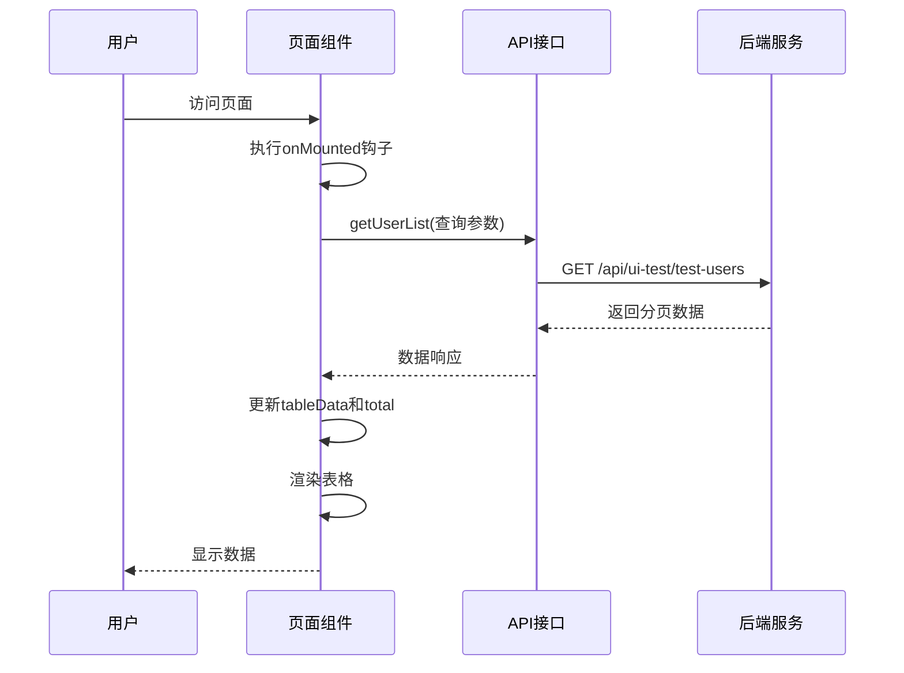
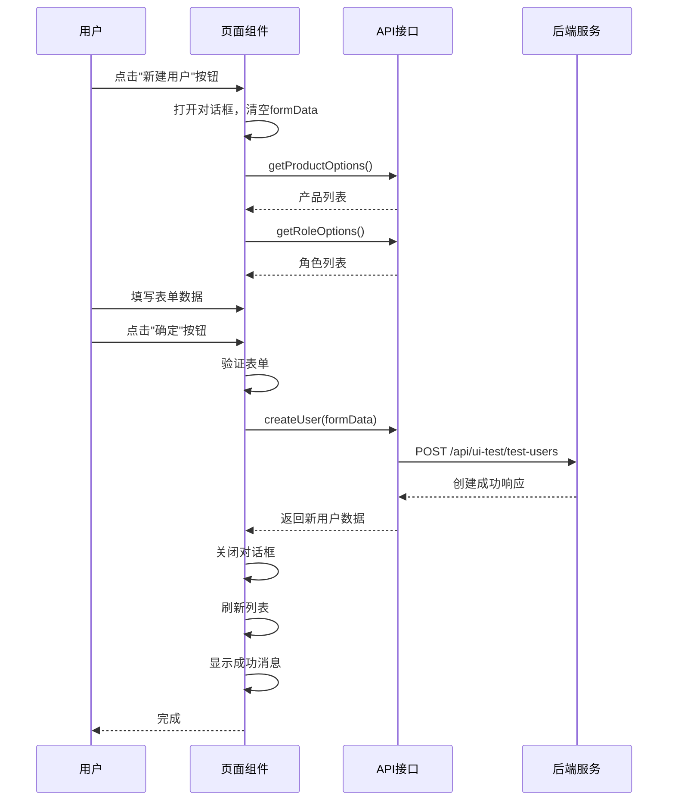
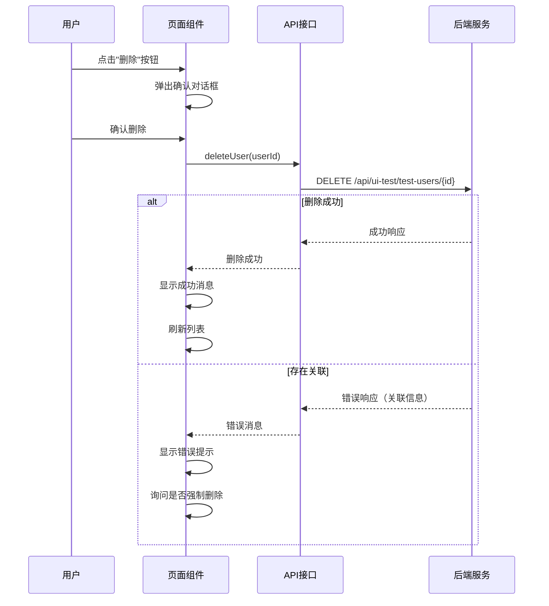

# 阶段二：测试用户管理模块实施方案

## 一、实施目标

基于已完成的ORM模型和Schema定义，实现测试用户管理的完整功能，包括后端API接口、前端页面组件和业务逻辑。

## 二、前置条件检查

### 2.1 已完成工作确认
- ✅ ORM模型定义（backend/app/models/ui_test.py）
- ✅ Schema定义（backend/app/schemas/ui_test.py）
- ✅ 模型导入配置（backend/app/models/__init__.py）

### 2.2 待执行数据库迁移
在开始API开发前，需要执行数据库迁移以创建表结构：

**操作步骤：**
1. 激活虚拟环境
2. 生成迁移文件
3. 执行迁移
4. 验证表创建成功

## 三、后端API实施方案

### 3.1 文件创建清单

#### 3.1.1 API路由文件
- 文件路径：`backend/app/api/ui_test_user.py`
- 职责：定义测试用户管理的API端点

#### 3.1.2 业务逻辑文件（可选）
- 文件路径：`backend/app/services/ui_test_user.py`
- 职责：封装复杂业务逻辑，保持路由层简洁

### 3.2 API端点实施清单

| 优先级 | 方法 | 路径 | 功能 | 依赖模型 |
|--------|------|------|------|----------|
| P0 | POST | /api/ui-test/test-users | 创建测试用户 | TestCommonUser |
| P0 | GET | /api/ui-test/test-users | 获取测试用户列表（分页+筛选） | TestCommonUser |
| P0 | GET | /api/ui-test/test-users/{id} | 获取单个测试用户详情 | TestCommonUser |
| P0 | PUT | /api/ui-test/test-users/{id} | 更新测试用户 | TestCommonUser |
| P0 | DELETE | /api/ui-test/test-users/{id} | 删除测试用户 | TestCommonUser |
| P1 | GET | /api/ui-test/test-users/products | 获取产品列表（去重） | TestCommonUser |
| P1 | GET | /api/ui-test/test-users/roles | 获取角色列表（去重） | TestCommonUser |

### 3.3 核心业务逻辑规则

#### 3.3.1 创建用户验证
- 用户名唯一性检查（同一产品下）
- 密码复杂度验证（6-255位，建议包含大小写字母和数字）
- 产品和角色名称非空验证
- 自动记录创建人（从当前登录用户获取）

#### 3.3.2 查询功能设计
**分页参数：**
- page：页码（默认1）
- page_size：每页条数（默认20，最大100）

**筛选条件：**
- username：用户名模糊搜索（LIKE）
- product：产品名称精确匹配
- role_name：角色名称精确匹配

**排序规则：**
- 默认按创建时间倒序

**返回字段处理：**
- 密码字段默认脱敏为"******"
- 包含创建人、创建时间、更新时间

#### 3.3.3 更新用户逻辑
- 支持部分字段更新
- 密码字段：如果提供则更新，否则保留原密码
- 用户名修改时重新检查唯一性
- 自动更新updated_time字段

#### 3.3.4 删除用户检查
**关联性检查：**
1. 检查是否有元素权限关联（TestUIElementPermission表）
2. 检查是否有用例权限关联（TestUICasePermission表）

**处理策略：**
- 如有关联，返回错误提示："该测试用户已关联X个元素权限和Y个用例权限，请先解除关联"
- 提供强制删除选项（级联删除关联记录）
- 软删除vs硬删除：建议使用硬删除（彻底清除）

#### 3.3.5 产品/角色列表获取
- 从TestCommonUser表中查询所有不重复的product值
- 从TestCommonUser表中查询所有不重复的role_name值
- 按字母顺序排序
- 用于前端下拉选择器的数据源

### 3.4 错误处理规范

| 错误场景 | HTTP状态码 | 错误码 | 错误消息示例 |
|----------|-----------|--------|--------------|
| 用户名重复 | 400 | DUPLICATE_USERNAME | "用户名'test_user'在产品'电商平台'下已存在" |
| 用户不存在 | 404 | USER_NOT_FOUND | "测试用户不存在" |
| 存在关联数据 | 400 | HAS_ASSOCIATIONS | "该用户已关联2个元素权限，无法删除" |
| 参数验证失败 | 422 | VALIDATION_ERROR | Pydantic自动生成 |
| 数据库操作失败 | 500 | DATABASE_ERROR | "数据库操作失败" |

### 3.5 API响应格式标准

#### 3.5.1 成功响应
```json
{
  "code": 200,
  "message": "success",
  "data": {
    // 具体数据内容
  }
}
```

#### 3.5.2 列表分页响应
```json
{
  "code": 200,
  "message": "success",
  "data": {
    "items": [...],
    "total": 100,
    "page": 1,
    "page_size": 20,
    "pages": 5
  }
}
```

#### 3.5.3 错误响应
```json
{
  "code": 400,
  "message": "用户名已存在",
  "data": null
}
```

## 四、前端页面实施方案

### 4.1 文件创建清单

#### 4.1.1 页面组件
- 文件路径：`frontend/src/views/UITest/TestUsers.vue`
- 组件名称：TestUsers
- 路由路径：`/ui-test/test-users`

#### 4.1.2 API接口封装
- 文件路径：`frontend/src/api/uitest.js`（新建）
- 职责：封装所有UI测试相关的API请求

### 4.2 页面布局设计

#### 4.2.1 页面结构树
```
TestUsers.vue
├── 页面头部
│   ├── 面包屑导航（首页 / UI测试 / 测试用户管理）
│   └── 页面标题
├── 操作工具栏
│   ├── 新建用户按钮（主按钮）
│   └── 批量导入按钮（次要按钮，可后续实现）
├── 搜索筛选区
│   ├── 用户名搜索框
│   ├── 产品选择器（可输入+可选择）
│   ├── 角色选择器（可输入+可选择）
│   └── 操作按钮组
│       ├── 搜索按钮
│       └── 重置按钮
├── 数据表格区
│   ├── 表格列定义
│   │   ├── 用户名列
│   │   ├── 密码列（带显示/隐藏切换）
│   │   ├── 产品列
│   │   ├── 角色列
│   │   ├── 描述列
│   │   ├── 创建人列
│   │   ├── 创建时间列
│   │   └── 操作列
│   │       ├── 编辑按钮
│   │       ├── 删除按钮
│   │       └── 查看权限按钮（可后续实现）
│   └── 表格配置
│       ├── 斑马纹样式
│       ├── 边框显示
│       └── 加载状态
├── 分页组件
│   ├── 总条数显示
│   ├── 每页条数选择器
│   └── 页码切换器
├── 新建/编辑对话框
│   ├── 对话框标题（新建/编辑测试用户）
│   ├── 表单区域
│   │   ├── 用户名输入框（必填）
│   │   ├── 密码输入框（必填，支持显示/隐藏切换）
│   │   ├── 产品选择器（必填，可输入可选择）
│   │   ├── 角色选择器（必填，可输入可选择）
│   │   └── 描述文本域（可选）
│   └── 操作按钮组
│       ├── 取消按钮
│       └── 确定按钮
└── 删除确认对话框
    ├── 提示信息
    └── 操作按钮组
        ├── 取消按钮
        └── 确认删除按钮
```

### 4.3 组件状态管理

#### 4.3.1 响应式数据定义
- tableData：表格数据数组
- total：总条数
- currentPage：当前页码
- pageSize：每页条数
- loading：加载状态
- searchForm：搜索表单对象
  - username：用户名搜索值
  - product：产品筛选值
  - role_name：角色筛选值
- dialogVisible：对话框显示状态
- dialogTitle：对话框标题
- formData：表单数据对象
- formRules：表单验证规则
- productOptions：产品选项列表
- roleOptions：角色选项列表
- passwordVisible：密码显示状态映射（表格行级别）
- formPasswordVisible：表单中密码显示状态

#### 4.3.2 计算属性
- passwordFieldType：根据passwordVisible状态计算input类型

### 4.4 核心功能实现

#### 4.4.1 数据加载流程


#### 4.4.2 搜索筛选功能
**触发时机：**
- 点击"搜索"按钮
- 按下Enter键（输入框绑定）

**处理逻辑：**
1. 重置页码为1
2. 收集searchForm中的非空值
3. 调用getUserList接口
4. 更新表格数据

**重置功能：**
1. 清空searchForm所有字段
2. 重置页码为1
3. 调用getUserList接口

#### 4.4.3 新建用户流程


#### 4.4.4 编辑用户流程
**触发：**
- 点击表格操作列的"编辑"按钮

**处理逻辑：**
1. 获取当前行数据
2. 深拷贝数据到formData（避免直接修改tableData）
3. 密码字段处理：显示为空，提示"不修改请留空"
4. 打开编辑对话框
5. 用户提交时：
   - 如果密码字段为空，不传递password字段
   - 如果密码字段有值，传递新密码

#### 4.4.5 删除用户流程


#### 4.4.6 密码显示切换功能
**表格中密码显示：**
- 默认显示："******"
- 点击"眼睛"图标：切换显示明文/密文
- 使用row.id作为key维护每行的显示状态

**表单中密码显示：**
- 输入框类型切换：password ↔ text
- 图标切换：眼睛闭合 ↔ 眼睛睁开

#### 4.4.7 产品/角色选择器设计
**组件选择：**
- 使用 `el-select` 组件
- 设置 `filterable` 启用搜索
- 设置 `allow-create` 允许创建新选项

**数据加载：**
- 对话框打开时加载选项列表
- 调用 `/api/ui-test/test-users/products` 获取产品
- 调用 `/api/ui-test/test-users/roles` 获取角色

**交互体验：**
- 支持输入搜索
- 支持手动输入新值（按Enter确认）
- 下拉显示已有选项

### 4.5 表单验证规则

| 字段 | 验证规则 | 错误提示 |
|------|----------|----------|
| username | 必填、长度2-100 | "请输入用户名，长度2-100字符" |
| password | 必填（新建时）、长度6-255 | "请输入密码，长度6-255字符" |
| product | 必填、长度1-100 | "请选择或输入产品名称" |
| role_name | 必填、长度1-100 | "请选择或输入角色名称" |
| description | 可选、最大500字符 | "描述最多500字符" |

### 4.6 UI样式规范

#### 4.6.1 主题色应用
- 主按钮颜色：使用全局 `@primary-color`（#d9232c）
- 链接颜色：使用 `@primary-color`
- 危险操作按钮：使用 Element Plus 的 `danger` 类型

#### 4.6.2 布局间距
- 页面内边距：20px
- 区块间距：使用 `@spacing-lg`
- 表单项间距：默认 Element Plus 间距
- 按钮组间距：8px

#### 4.6.3 表格样式
- 启用斑马纹：`stripe`
- 显示边框：`border`
- 表头背景色：浅灰色
- 操作列宽度：180px
- 操作按钮：文字按钮类型

#### 4.6.4 对话框样式
- 宽度：600px
- 表单标签宽度：100px
- 表单项垂直间距：Element Plus 默认

## 五、路由配置

### 5.1 路由定义
- 路径：`/ui-test/test-users`
- 组件：TestUsers
- 名称：UITestUsers
- 元信息：
  - title: "测试用户管理"
  - requiresAuth: true

### 5.2 菜单配置
如果项目使用动态菜单，需要在菜单配置中添加：
- 父菜单：UI测试
- 子菜单：测试用户管理
- 图标：user图标
- 排序：第一项

## 六、开发步骤建议

### 6.1 后端开发顺序
1. 创建API路由文件 `ui_test_user.py`
2. 实现创建用户接口（POST）
3. 实现获取列表接口（GET，带分页和筛选）
4. 实现获取详情接口（GET）
5. 实现更新用户接口（PUT）
6. 实现删除用户接口（DELETE，含关联检查）
7. 实现获取产品列表接口（GET）
8. 实现获取角色列表接口（GET）
9. 在主应用中注册路由

### 6.2 前端开发顺序
1. 创建API接口封装文件 `uitest.js`
2. 创建页面组件 `TestUsers.vue`
3. 实现页面基础布局（工具栏、搜索区、表格、分页）
4. 实现数据加载功能
5. 实现搜索筛选功能
6. 实现新建用户功能（对话框+表单）
7. 实现编辑用户功能
8. 实现删除用户功能
9. 实现密码显示切换功能
10. 实现产品/角色选择器
11. 配置路由和菜单
12. 样式调整和优化

### 6.3 测试验证清单
- [ ] 创建用户成功
- [ ] 用户名重复校验生效
- [ ] 列表分页正常
- [ ] 搜索筛选功能正常
- [ ] 编辑用户成功
- [ ] 密码修改正常
- [ ] 密码留空不修改
- [ ] 删除用户成功
- [ ] 删除时关联检查生效
- [ ] 产品/角色下拉数据正常
- [ ] 密码显示切换正常
- [ ] 表单验证规则生效
- [ ] 响应式布局适配

## 七、技术要点提示

### 7.1 后端技术要点
- 使用Tortoise ORM的查询构建器实现动态筛选
- 使用 `Q` 对象实现复杂查询条件
- 分页使用 `limit()` 和 `offset()`
- 去重使用 `distinct()` 方法
- 关联查询使用 `prefetch_related()` 或 `select_related()`
- 密码字段在响应中脱敏处理
- 使用FastAPI的依赖注入获取当前登录用户

### 7.2 前端技术要点
- 使用 `ref` 和 `reactive` 管理组件状态
- 使用 `onMounted` 钩子初始化数据
- 使用 `ElMessage` 显示操作提示
- 使用 `ElMessageBox` 实现确认对话框
- 密码字段使用 `v-model` 双向绑定
- 表单验证使用 `el-form` 的 `rules` 属性
- 使用 `deep clone` 避免直接修改原数据
- 使用 `async/await` 处理异步请求

### 7.3 注意事项
- 密码字段安全：前端不应缓存明文密码
- 编辑时密码处理：空值不传递给后端
- 删除操作二次确认：防止误删
- 列表刷新时机：新建、编辑、删除成功后
- 错误信息展示：使用用户友好的提示文案
- 加载状态反馈：请求期间显示loading

## 八、预期交付成果

### 8.1 后端交付物
- `backend/app/api/ui_test_user.py`（约200-300行）
- 路由注册配置更新
- API文档自动生成（Swagger）

### 8.2 前端交付物
- `frontend/src/api/uitest.js`（约100-150行）
- `frontend/src/views/UITest/TestUsers.vue`（约500-700行）
- 路由配置更新
- 菜单配置更新

### 8.3 功能验收标准
- 所有API接口正常响应
- 前端页面UI符合设计规范
- 所有核心功能正常运行
- 表单验证规则生效
- 错误处理友好
- 无明显性能问题
