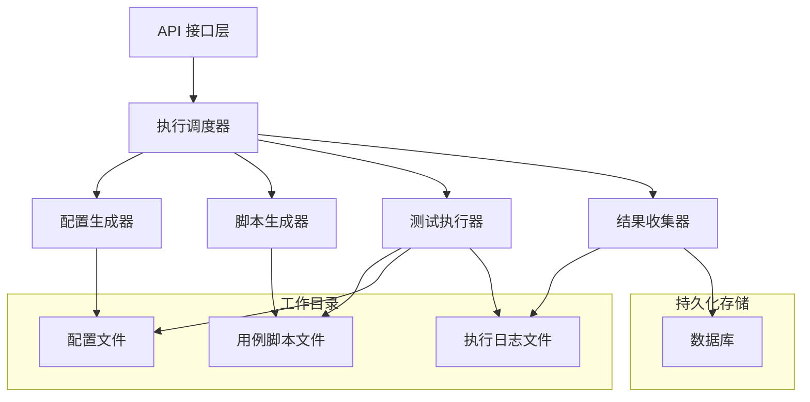
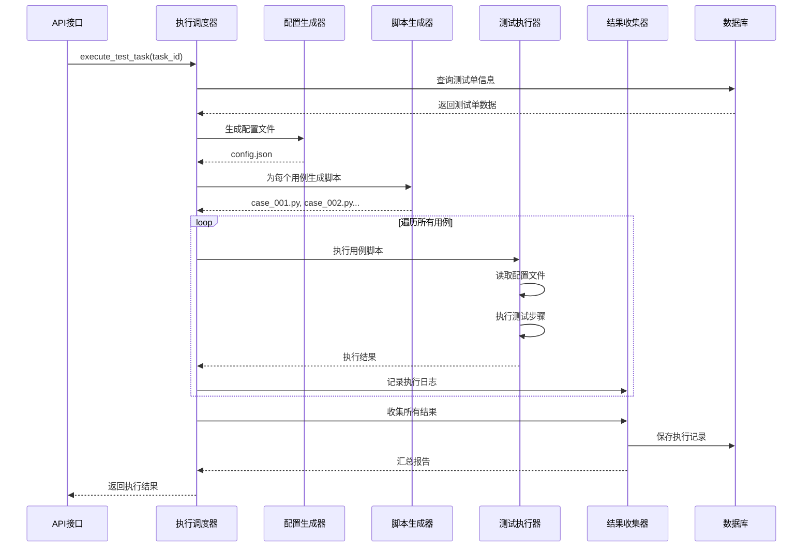
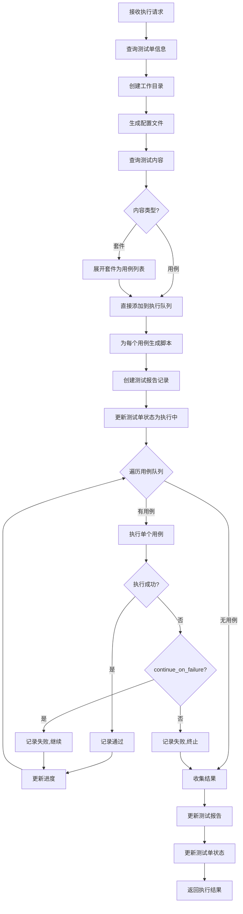
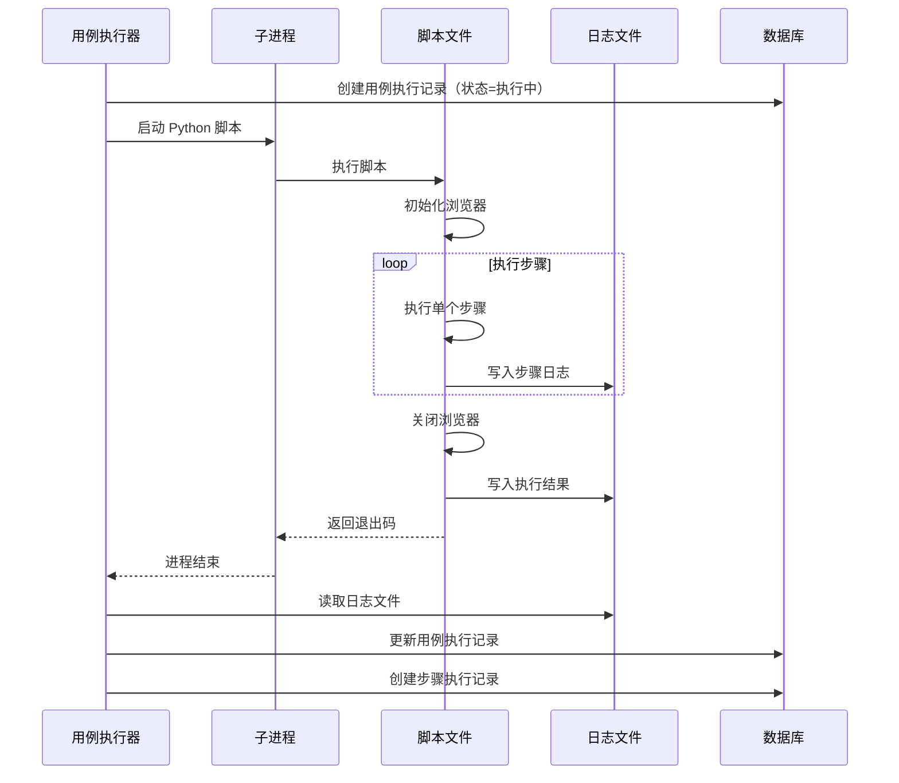
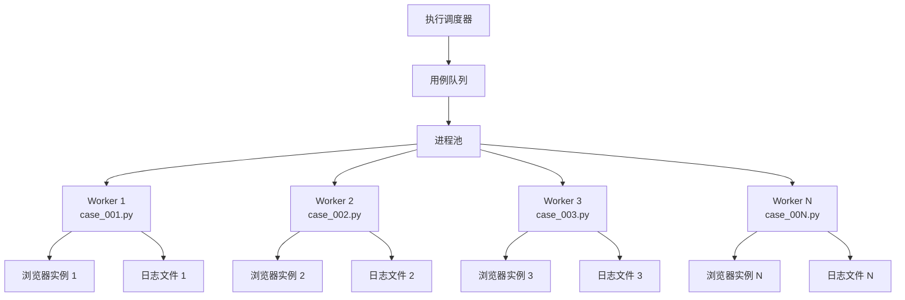
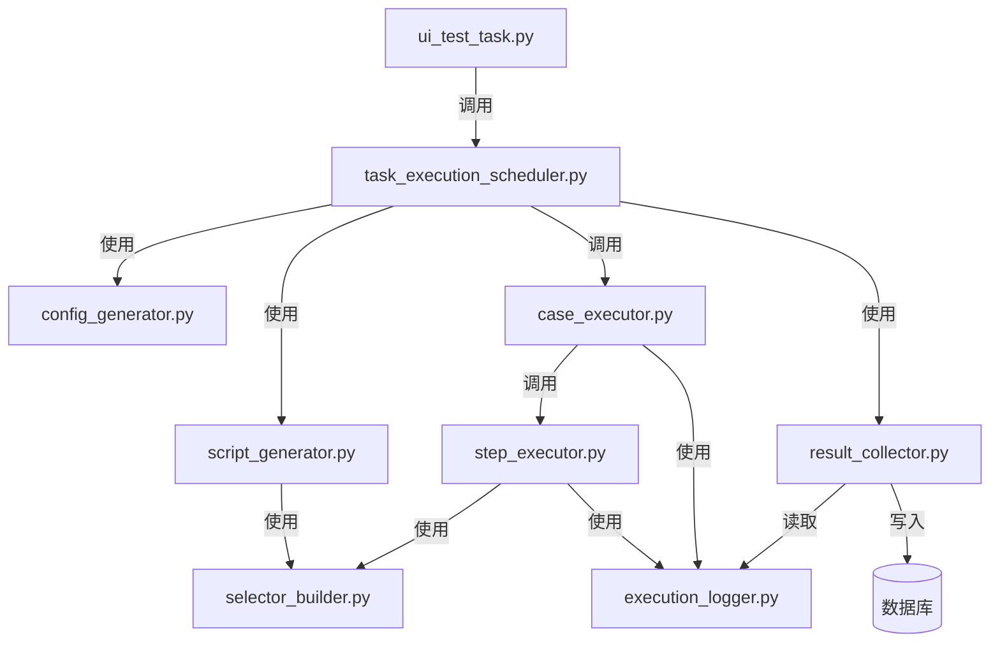

# Playwright 执行引擎设计文档

## 一、需求概述

### 1.1 功能目标
实现基于 Playwright 的 UI 自动化测试执行引擎，支持测试单的完整执行流程，包括脚本生成、配置管理、执行监控和结果收集。

### 1.2 核心需求
- 执行测试单时自动生成常量配置文件，集中管理测试环境变量
- 为每个测试用例生成独立的 Playwright 脚本，支持手动执行
- 脚本可读取配置文件获取 host、username、password 等变量
- 执行过程中实时记录每个步骤的进度、耗时和结果
- 按用例维度分文件存储执行日志，便于问题定位
- 执行引擎负责收集所有用例的执行结果并汇总

### 1.3 约束条件
- 不允许使用 MCP（Model Context Protocol）工具
- 使用 Playwright Python 异步 API
- 遵循现有项目的技术架构和代码规范
- 支持 chromium、firefox、webkit 三种浏览器

## 二、总体架构设计

### 2.1 核心组件关系



### 2.2 数据流转过程



## 三、工作目录结构设计

### 3.1 目录组织规范

所有执行相关文件统一存储在项目根目录下的 `test_executions` 目录中：

```
test_executions/
├── task_{task_id}_{timestamp}/          # 每次执行创建唯一目录
│   ├── config.json                       # 测试配置文件
│   ├── scripts/                          # 生成的脚本目录
│   │   ├── case_{case_id}_001.py        # 用例1脚本
│   │   ├── case_{case_id}_002.py        # 用例2脚本
│   │   └── ...
│   ├── logs/                             # 执行日志目录
│   │   ├── case_{case_id}_001.json      # 用例1执行日志
│   │   ├── case_{case_id}_002.json      # 用例2执行日志
│   │   └── ...
│   ├── screenshots/                      # 截图目录
│   │   ├── case_001_step_003.png        # 失败步骤截图
│   │   └── ...
│   └── execution_summary.json            # 执行汇总信息
```

### 3.2 目录命名规则

| 目录/文件 | 命名规则 | 示例 |
|----------|----------|------|
| 任务执行目录 | task_{task_id}_{timestamp} | task_123_20240115143000 |
| 脚本文件 | case_{case_id}_{序号}.py | case_45_001.py |
| 日志文件 | case_{case_id}_{序号}.json | case_45_001.json |
| 截图文件 | case_{序号}_step_{步骤号}.png | case_001_step_003.png |

### 3.3 文件清理策略

- 保留最近 30 天的执行目录
- 支持手动删除指定任务的执行目录
- 提供定期清理的后台任务

## 四、配置文件设计

### 4.1 配置文件结构（config.json）

```json
{
  "task_info": {
    "task_id": 123,
    "task_name": "回归测试-2024-01-15",
    "environment": "测试环境",
    "created_by": "admin",
    "created_time": "2024-01-15 14:30:00"
  },
  "execute_config": {
    "browser": "chromium",
    "headless": true,
    "timeout": 30000,
    "continue_on_failure": true,
    "retry_count": 2,
    "auto_screenshot": true,
    "viewport": {
      "width": 1920,
      "height": 1080
    }
  },
  "test_users": {
    "VIP会员": {
      "username": "vip_user_001",
      "password": "Test@123456"
    },
    "普通会员": {
      "username": "normal_user_001",
      "password": "Test@123456"
    }
  },
  "environment_variables": {
    "host": "http://localhost:5173",
    "api_host": "http://localhost:9998",
    "admin_username": "admin",
    "admin_password": "111111aA"
  }
}
```

### 4.2 配置项说明

| 配置节 | 字段 | 类型 | 说明 |
|-------|------|------|------|
| task_info | task_id | int | 测试单ID |
| task_info | task_name | string | 测试单名称 |
| task_info | environment | string | 测试环境标识 |
| execute_config | browser | string | 浏览器类型 |
| execute_config | headless | boolean | 是否无头模式 |
| execute_config | timeout | int | 超时时间（毫秒） |
| execute_config | continue_on_failure | boolean | 失败后是否继续 |
| execute_config | retry_count | int | 重试次数 |
| execute_config | auto_screenshot | boolean | 失败时自动截图 |
| test_users | {role_name} | object | 角色对应的测试用户凭证 |
| environment_variables | 自定义 | any | 环境相关变量 |

## 五、脚本生成设计

### 5.1 脚本生成策略

为每个测试用例生成一个独立的 Python 脚本文件，脚本包含：

- 配置文件读取逻辑
- 浏览器初始化逻辑
- 测试步骤执行逻辑
- 结果记录逻辑
- 异常处理逻辑

### 5.2 脚本模板结构

每个生成的脚本遵循以下结构：

```python
# 文件头部说明
"""
测试用例自动生成脚本
用例ID: {case_id}
用例名称: {case_name}
优先级: {priority}
模块: {module}
生成时间: {generated_time}

执行方式：
    python {script_filename}
    
环境变量：
    DEBUG=1 启用详细日志
    HEADLESS=0 使用有头模式
    SLOW_MO=500 减慢操作速度
"""

import asyncio
import json
import os
import sys
import traceback
from datetime import datetime
from pathlib import Path
from playwright.async_api import async_playwright, TimeoutError as PlaywrightTimeout

# ==================== 全局配置 ====================

SCRIPT_DIR = Path(__file__).parent
WORK_DIR = SCRIPT_DIR.parent
CONFIG_PATH = WORK_DIR / "config.json"
LOG_PATH = WORK_DIR / "logs" / "case_{case_id}_{sequence}.json"
SCREENSHOT_DIR = WORK_DIR / "screenshots"

# 用例信息
CASE_ID = {case_id}
CASE_NAME = "{case_name}"
CASE_PRIORITY = "{priority}"
CASE_MODULE = "{module}"

# 环境变量配置
DEBUG = os.getenv('DEBUG', '0') == '1'
HEADLESS = os.getenv('HEADLESS', '1') == '1'
SLOW_MO = int(os.getenv('SLOW_MO', '0'))

# ==================== 日志记录 ====================

class ExecutionLogger:
    """执行日志记录器"""
    
    def __init__(self, log_path):
        self.log_path = log_path
        self.log_data = {
            "case_info": {
                "case_id": CASE_ID,
                "case_name": CASE_NAME,
                "priority": CASE_PRIORITY,
                "module": CASE_MODULE
            },
            "execution_info": {
                "start_time": None,
                "end_time": None,
                "duration": 0,
                "status": "执行中",
                "error_message": None
            },
            "steps": [],
            "retry_count": 0,
            "screenshots": []
        }
    
    def start_execution(self):
        """记录执行开始"""
        self.log_data["execution_info"]["start_time"] = datetime.now().strftime("%Y-%m-%d %H:%M:%S")
        self._write_log()
    
    def end_execution(self, status, error_message=None):
        """记录执行结束"""
        end_time = datetime.now()
        start_time = datetime.strptime(
            self.log_data["execution_info"]["start_time"],
            "%Y-%m-%d %H:%M:%S"
        )
        duration = int((end_time - start_time).total_seconds())
        
        self.log_data["execution_info"]["end_time"] = end_time.strftime("%Y-%m-%d %H:%M:%S")
        self.log_data["execution_info"]["duration"] = duration
        self.log_data["execution_info"]["status"] = status
        self.log_data["execution_info"]["error_message"] = error_message
        self._write_log()
    
    def log_step(self, step_number, action, description, status, duration, error_message=None, screenshot_path=None):
        """记录步骤执行"""
        step_log = {
            "step_number": step_number,
            "action": action,
            "description": description,
            "start_time": datetime.now().strftime("%Y-%m-%d %H:%M:%S"),
            "end_time": datetime.now().strftime("%Y-%m-%d %H:%M:%S"),
            "duration": duration,
            "status": status,
            "error_message": error_message,
            "screenshot_path": screenshot_path
        }
        self.log_data["steps"].append(step_log)
        
        if screenshot_path:
            self.log_data["screenshots"].append(screenshot_path)
        
        self._write_log()
    
    def increment_retry(self):
        """增加重试计数"""
        self.log_data["retry_count"] += 1
        self._write_log()
    
    def _write_log(self):
        """写入日志文件"""
        os.makedirs(self.log_path.parent, exist_ok=True)
        with open(self.log_path, 'w', encoding='utf-8') as f:
            json.dump(self.log_data, f, ensure_ascii=False, indent=2)

# ==================== 配置加载 ====================

def load_config():
    """加载配置文件"""
    try:
        with open(CONFIG_PATH, 'r', encoding='utf-8') as f:
            return json.load(f)
    except Exception as e:
        print(f"加载配置文件失败: {e}")
        sys.exit(1)

# ==================== 选择器构建 ====================

def build_selector(selector_type, selector_value):
    """构建 Playwright 选择器"""
    selector_map = {
        'ID': f'#{selector_value}',
        'NAME': f'[name="{selector_value}"]',
        'CSS': selector_value,
        'XPATH': f'xpath={selector_value}',
        'CLASS_NAME': f'.{selector_value}',
        'TAG_NAME': selector_value,
        'LINK_TEXT': f'text={selector_value}',
        'PARTIAL_LINK_TEXT': f'text=/{selector_value}/',
        'TEST_ID': f'[data-testid="{selector_value}"]'
    }
    return selector_map.get(selector_type, selector_value)

# ==================== 截图工具 ====================

async def take_screenshot(page, step_number):
    """截取屏幕截图"""
    os.makedirs(SCREENSHOT_DIR, exist_ok=True)
    timestamp = datetime.now().strftime("%Y%m%d%H%M%S")
    filename = f"case_{CASE_ID:03d}_step_{step_number:03d}_{timestamp}.png"
    screenshot_path = SCREENSHOT_DIR / filename
    await page.screenshot(path=str(screenshot_path))
    return str(screenshot_path.relative_to(WORK_DIR))

# ==================== 主测试函数 ====================

async def test_case_{case_id}():
    """用例主函数"""
    logger = ExecutionLogger(LOG_PATH)
    logger.start_execution()
    
    config = load_config()
    execute_config = config['execute_config']
    
    # 获取测试用户（如果配置了权限）
    test_user = None
    {user_loading_code}
    
    try:
        async with async_playwright() as p:
            # 启动浏览器
            browser_type = execute_config.get('browser', 'chromium')
            browser_args = {
                'headless': HEADLESS if not DEBUG else False,
                'slow_mo': SLOW_MO
            }
            
            if browser_type == 'chromium':
                browser = await p.chromium.launch(**browser_args)
            elif browser_type == 'firefox':
                browser = await p.firefox.launch(**browser_args)
            elif browser_type == 'webkit':
                browser = await p.webkit.launch(**browser_args)
            else:
                browser = await p.chromium.launch(**browser_args)
            
            # 创建页面
            viewport = execute_config.get('viewport', {'width': 1920, 'height': 1080})
            page = await browser.new_page(viewport=viewport)
            
            # 设置默认超时
            default_timeout = execute_config.get('timeout', 30000)
            page.set_default_timeout(default_timeout)
            
            try:
                {steps_execution_code}
                
                # 所有步骤通过
                logger.end_execution("通过")
                print(f"✓ 用例执行成功: {CASE_NAME}")
                sys.exit(0)
                
            except Exception as step_error:
                # 步骤执行失败
                error_msg = f"{type(step_error).__name__}: {str(step_error)}"
                logger.end_execution("失败", error_msg)
                
                # 失败截图
                if execute_config.get('auto_screenshot', True):
                    try:
                        screenshot_path = await take_screenshot(page, 999)
                        logger.log_data["screenshots"].append(screenshot_path)
                        logger._write_log()
                    except:
                        pass
                
                print(f"✗ 用例执行失败: {CASE_NAME}")
                print(f"  错误信息: {error_msg}")
                if DEBUG:
                    traceback.print_exc()
                sys.exit(1)
            
            finally:
                await browser.close()
    
    except Exception as e:
        # 浏览器启动失败
        error_msg = f"浏览器初始化失败: {str(e)}"
        logger.end_execution("失败", error_msg)
        print(f"✗ {error_msg}")
        if DEBUG:
            traceback.print_exc()
        sys.exit(1)

# ==================== 脚本入口 ====================

if __name__ == "__main__":
    print(f"开始执行用例: {CASE_NAME} (ID: {CASE_ID})")
    asyncio.run(test_case_{case_id}())
```

### 5.3 用户加载代码生成

根据用例权限配置生成用户加载代码：

**无权限配置**
```python
# 使用环境变量中的默认用户
test_user = {
    'username': config['environment_variables'].get('admin_username'),
    'password': config['environment_variables'].get('admin_password')
}
```

**有权限配置**
```python
# 从配置中获取指定角色的测试用户
role_name = "VIP会员"  # 从用例权限获取
if role_name in config['test_users']:
    test_user = config['test_users'][role_name]
else:
    # 回退到默认用户
    test_user = {
        'username': config['environment_variables'].get('admin_username'),
        'password': config['environment_variables'].get('admin_password')
    }
```

### 5.4 步骤代码生成规则

根据步骤的 action 类型生成对应的 Playwright 调用代码：

| Action 类型 | 生成代码模板 |
|------------|--------------|
| navigate | `await page.goto('{url}')` |
| click | `await page.click('{selector}')` |
| type | `await page.fill('{selector}', '{input_data}')` |
| select | `await page.select_option('{selector}', '{value}')` |
| wait | `await page.wait_for_timeout({milliseconds})` |
| wait_for_element | `await page.wait_for_selector('{selector}')` |
| assert_text | `assert await page.text_content('{selector}') == '{expected}'` |
| assert_exists | `assert await page.is_visible('{selector}')` |
| screenshot | `await page.screenshot(path='{path}')` |
| hover | `await page.hover('{selector}')` |
| clear | `await page.fill('{selector}', '')` |

### 5.5 步骤执行代码生成示例

**步骤 1: 导航到登录页面**
```python
# 步骤 1: 打开登录页面
step_start = datetime.now()
try:
    await page.goto(config['environment_variables']['host'] + '/login')
    step_duration = int((datetime.now() - step_start).total_seconds() * 1000)
    logger.log_step(1, "navigate", "打开登录页面", "通过", step_duration)
    if DEBUG:
        print(f"  ✓ 步骤 1: 打开登录页面")
except Exception as e:
    step_duration = int((datetime.now() - step_start).total_seconds() * 1000)
    logger.log_step(1, "navigate", "打开登录页面", "失败", step_duration, str(e))
    raise
```

**步骤 2: 输入用户名**
```python
# 步骤 2: 输入用户名
step_start = datetime.now()
try:
    selector = build_selector('ID', 'username')
    await page.fill(selector, test_user['username'])
    step_duration = int((datetime.now() - step_start).total_seconds() * 1000)
    logger.log_step(2, "type", "输入用户名", "通过", step_duration)
    if DEBUG:
        print(f"  ✓ 步骤 2: 输入用户名")
except Exception as e:
    step_duration = int((datetime.now() - step_start).total_seconds() * 1000)
    screenshot_path = None
    if execute_config.get('auto_screenshot', True):
        screenshot_path = await take_screenshot(page, 2)
    logger.log_step(2, "type", "输入用户名", "失败", step_duration, str(e), screenshot_path)
    raise
```

**步骤 3: 断言文本**
```python
# 步骤 3: 验证欢迎消息
step_start = datetime.now()
try:
    selector = build_selector('CSS', '.welcome-msg')
    actual_text = await page.text_content(selector)
    expected_text = "欢迎登录"
    assert actual_text == expected_text, f"期望文本 '{expected_text}'，实际文本 '{actual_text}'"
    step_duration = int((datetime.now() - step_start).total_seconds() * 1000)
    logger.log_step(3, "assert_text", "验证欢迎消息", "通过", step_duration)
    if DEBUG:
        print(f"  ✓ 步骤 3: 验证欢迎消息")
except Exception as e:
    step_duration = int((datetime.now() - step_start).total_seconds() * 1000)
    screenshot_path = None
    if execute_config.get('auto_screenshot', True):
        screenshot_path = await take_screenshot(page, 3)
    logger.log_step(3, "assert_text", "验证欢迎消息", "失败", step_duration, str(e), screenshot_path)
    raise
```

### 5.6 配置变量替换

脚本生成时支持配置变量的自动替换：

| 变量占位符 | 替换逻辑 | 生成代码示例 |
|----------|---------|-------------|
| `{{host}}` | config['environment_variables']['host'] | `config['environment_variables']['host']` |
| `{{api_host}}` | config['environment_variables']['api_host'] | `config['environment_variables']['api_host']` |
| `{{username}}` | test_user['username'] | `test_user['username']` |
| `{{password}}` | test_user['password'] | `test_user['password']` |
| `{{自定义变量}}` | config['environment_variables']['自定义变量'] | `config['environment_variables']['自定义变量']` |

**替换规则**
1. 识别 input_data 中的 `{{变量名}}` 格式
2. 优先从 test_user 查找
3. 其次从 environment_variables 查找
4. 未找到时保持原值并记录警告

**代码生成示例**

原始步骤数据：
```json
{
  "action": "type",
  "element_id": 123,
  "input_data": "{{username}}",
  "description": "输入用户名"
}
```

生成的代码：
```python
await page.fill(selector, test_user['username'])
```

## 六、执行日志设计

### 6.1 日志文件结构（case_xxx.json）

```json
{
  "case_info": {
    "case_id": 45,
    "case_name": "用户登录功能测试",
    "priority": "高",
    "status": "激活"
  },
  "execution_info": {
    "start_time": "2024-01-15 14:30:05",
    "end_time": "2024-01-15 14:30:35",
    "duration": 30,
    "status": "通过",
    "error_message": null
  },
  "steps": [
    {
      "step_number": 1,
      "action": "navigate",
      "description": "打开登录页面",
      "start_time": "2024-01-15 14:30:05",
      "end_time": "2024-01-15 14:30:07",
      "duration": 2000,
      "status": "通过",
      "error_message": null,
      "screenshot_path": null
    },
    {
      "step_number": 2,
      "action": "type",
      "description": "输入用户名",
      "start_time": "2024-01-15 14:30:07",
      "end_time": "2024-01-15 14:30:08",
      "duration": 1000,
      "status": "通过",
      "error_message": null,
      "screenshot_path": null
    },
    {
      "step_number": 3,
      "action": "click",
      "description": "点击登录按钮",
      "start_time": "2024-01-15 14:30:10",
      "end_time": "2024-01-15 14:30:11",
      "duration": 1000,
      "status": "失败",
      "error_message": "元素未找到: #login-btn",
      "screenshot_path": "../screenshots/case_001_step_003.png"
    }
  ],
  "retry_count": 0,
  "screenshots": [
    "../screenshots/case_001_step_003.png"
  ]
}
```

### 6.2 日志记录时机

| 时机 | 记录内容 |
|------|---------|
| 用例开始 | 创建日志文件，写入 case_info 和 execution_info（初始状态） |
| 每步开始 | 记录步骤开始时间 |
| 每步结束 | 记录步骤结束时间、耗时、状态、错误信息 |
| 步骤失败且开启截图 | 保存截图并记录路径 |
| 用例结束 | 更新 execution_info（结束时间、总耗时、最终状态） |
| 重试触发 | 更新 retry_count |

### 6.3 日志写入策略

- 使用追加写入模式，避免覆盖已有数据
- 每个步骤执行后立即写入日志，确保异常中断时数据不丢失
- 日志文件使用 UTF-8 编码，确保中文正常显示

## 七、执行器设计

### 7.1 执行调度器职责

执行调度器（TaskExecutionScheduler）负责整个测试单的执行协调：

**核心职责**
- 接收 API 执行请求
- 创建工作目录
- 生成配置文件
- 查询测试单内容（套件和用例）
- 展开套件为用例列表
- 为每个用例生成脚本
- 按顺序调度用例执行
- 收集执行结果
- 创建测试报告
- 更新测试单状态

**执行流程**



### 7.2 用例执行器职责

用例执行器（CaseExecutor）负责单个用例的执行：

**核心职责**
- 加载用例信息和测试步骤
- 检查用例权限，加载对应测试用户
- 创建用例执行记录
- 使用 subprocess 执行独立脚本文件
- 监控脚本执行进程
- 读取脚本输出的日志文件
- 处理超时和异常
- 更新用例执行记录

**执行模式：脚本文件模式**

采用脚本文件模式的优势：
- 脚本完全独立，可手动执行
- 进程隔离，一个脚本崩溃不影响其他脚本
- 支持并发执行，每个脚本独立进程
- 便于调试和问题定位
- 脚本可版本化管理

**脚本执行流程**



**subprocess 调用参数**

```python
import subprocess
import sys

process = subprocess.Popen(
    [sys.executable, script_path],
    stdout=subprocess.PIPE,
    stderr=subprocess.PIPE,
    text=True,
    cwd=work_dir,
    env={
        'PYTHONPATH': project_root,
        'PLAYWRIGHT_BROWSERS_PATH': browsers_path
    }
)
```

**超时控制**

```python
try:
    stdout, stderr = process.communicate(timeout=max_execution_time)
    exit_code = process.returncode
except subprocess.TimeoutExpired:
    process.kill()
    # 记录超时异常
```

### 7.3 步骤执行器职责

步骤执行器（StepExecutor）负责单个步骤的执行：

**核心职责**
- 解析步骤操作类型
- 加载元素定位信息
- 构建 Playwright 选择器
- 替换配置变量
- 调用 Playwright API 执行操作
- 捕获执行异常
- 记录步骤开始和结束时间
- 创建步骤执行记录

**选择器构建规则**

| selector_type | selector_value | Playwright 选择器 |
|---------------|----------------|-------------------|
| ID | "submit-btn" | "#submit-btn" |
| NAME | "username" | "[name='username']" |
| CSS | ".login-form .btn" | ".login-form .btn" |
| XPATH | "//div[@class='btn']" | "xpath=//div[@class='btn']" |
| CLASS_NAME | "btn-primary" | ".btn-primary" |
| TAG_NAME | "button" | "button" |
| LINK_TEXT | "登录" | "text=登录" |
| PARTIAL_LINK_TEXT | "登" | "text=/登/" |
| TEST_ID | "login-btn" | "[data-testid='login-btn']" |

**操作执行映射**

每个 action 对应的 Playwright 调用逻辑：

- **navigate**: 
  - 调用 `page.goto(url)`
  - 等待页面加载完成
  
- **click**: 
  - 调用 `page.click(selector)`
  - 等待元素可点击
  
- **type**: 
  - 调用 `page.fill(selector, text)`
  - 先清空再输入
  
- **select**: 
  - 调用 `page.select_option(selector, value)`
  - 支持单选或多选
  
- **wait**: 
  - 调用 `page.wait_for_timeout(milliseconds)`
  
- **wait_for_element**: 
  - 调用 `page.wait_for_selector(selector)`
  - 等待元素出现且可见
  
- **assert_text**: 
  - 调用 `page.text_content(selector)`
  - 比较文本内容
  - 不匹配时抛出异常
  
- **assert_exists**: 
  - 调用 `page.is_visible(selector)`
  - 验证元素可见性
  - 不可见时抛出异常
  
- **screenshot**: 
  - 调用 `page.screenshot(path=...)`
  - 保存到 screenshots 目录
  
- **hover**: 
  - 调用 `page.hover(selector)`
  
- **clear**: 
  - 调用 `page.fill(selector, '')`
  
- **execute_script**: 
  - 调用 `page.evaluate(script)`
  
- **switch_frame**: 
  - 调用 `page.frame(name_or_url)`
  
- **go_back**: 
  - 调用 `page.go_back()`
  
- **refresh**: 
  - 调用 `page.reload()`

## 八、结果收集设计

### 8.1 收集器职责

结果收集器（ResultCollector）负责收集和汇总执行结果：

**核心职责**
- 读取所有用例的执行日志文件
- 解析日志内容
- 创建用例执行记录（test_ui_case_execution_records）
- 创建步骤执行记录（test_ui_case_step_execution_records）
- 更新测试报告统计数据
- 生成执行汇总文件

### 8.2 数据库记录结构

**用例执行记录表（test_ui_case_execution_records）**

| 字段 | 类型 | 说明 | 数据来源 |
|------|------|------|---------|
| id | bigint | 主键 | 自动生成 |
| test_case_id | bigint | 用例ID | 日志文件 case_info.case_id |
| test_report_id | bigint | 报告ID | 执行调度器创建 |
| status | varchar | 执行状态 | 日志文件 execution_info.status |
| start_time | datetime | 开始时间 | 日志文件 execution_info.start_time |
| end_time | datetime | 结束时间 | 日志文件 execution_info.end_time |
| duration | int | 耗时（秒） | 日志文件 execution_info.duration |
| error_message | text | 错误信息 | 日志文件 execution_info.error_message |
| screenshot_path | varchar | 截图路径 | 日志文件 screenshots |

**步骤执行记录表（test_ui_case_step_execution_records）**

| 字段 | 类型 | 说明 | 数据来源 |
|------|------|------|---------|
| id | bigint | 主键 | 自动生成 |
| case_execution_record_id | bigint | 用例执行记录ID | 关联字段 |
| step_number | int | 步骤序号 | 日志文件 steps[].step_number |
| action | varchar | 操作类型 | 日志文件 steps[].action |
| element_id | bigint | 元素ID | 根据 case_id 和 step_number 查询 |
| input_data | varchar | 输入数据 | 步骤定义 |
| status | varchar | 执行状态 | 日志文件 steps[].status |
| start_time | datetime | 开始时间 | 日志文件 steps[].start_time |
| end_time | datetime | 结束时间 | 日志文件 steps[].end_time |
| duration | int | 耗时（毫秒） | 日志文件 steps[].duration |
| error_message | text | 错误信息 | 日志文件 steps[].error_message |
| screenshot_path | varchar | 截图路径 | 日志文件 steps[].screenshot_path |

### 8.3 执行汇总文件（execution_summary.json）

```json
{
  "task_info": {
    "task_id": 123,
    "task_name": "回归测试-2024-01-15",
    "environment": "测试环境"
  },
  "execution_summary": {
    "start_time": "2024-01-15 14:30:00",
    "end_time": "2024-01-15 14:35:00",
    "duration": 300,
    "total_cases": 20,
    "passed_cases": 18,
    "failed_cases": 2,
    "skipped_cases": 0,
    "pass_rate": 90.0
  },
  "case_results": [
    {
      "case_id": 45,
      "case_name": "用户登录功能测试",
      "status": "通过",
      "duration": 30,
      "start_time": "2024-01-15 14:30:05",
      "end_time": "2024-01-15 14:30:35"
    }
  ],
  "failed_cases_detail": [
    {
      "case_id": 47,
      "case_name": "密码重置功能测试",
      "error_message": "元素未找到: #reset-btn",
      "failed_step": 5,
      "screenshot_path": "../screenshots/case_003_step_005.png"
    }
  ]
}
```

## 九、测试用户管理

### 9.1 用户权限匹配

测试用例可能配置了权限角色（通过 test_ui_case_permissions 表），执行时需要选择对应角色的测试用户：

**匹配逻辑**
1. 查询用例的权限角色列表
2. 如果用例没有配置权限，使用环境变量中的默认用户
3. 如果用例配置了权限，选择第一个匹配的角色
4. 从 test_common_users 表查询对应角色的用户
5. 如果找不到匹配用户，使用默认用户或抛出异常

**配置文件生成**

在生成 config.json 时，需要：
1. 查询所有即将执行的用例
2. 收集所有涉及的权限角色
3. 为每个角色从 test_common_users 查询一个可用用户
4. 写入 config.json 的 test_users 节

### 9.2 用户信息使用

脚本执行时，可通过配置文件获取用户信息：

```python
config = await load_config()
role_name = "VIP会员"  # 从用例权限获取
username = config['test_users'][role_name]['username']
password = config['test_users'][role_name]['password']
```

## 十、异常处理策略

### 10.1 异常分类

| 异常类型 | 处理策略 | 影响范围 |
|---------|---------|---------|
| 配置文件缺失 | 抛出异常，终止执行 | 整个测试单 |
| 脚本生成失败 | 记录错误，跳过该用例 | 单个用例 |
| 浏览器启动失败 | 记录错误，终止执行 | 整个测试单 |
| 元素定位失败 | 重试，超过次数后记录失败 | 单个步骤 |
| 断言失败 | 记录失败，根据 continue_on_failure 决定是否继续 | 单个步骤 |
| 超时异常 | 记录失败，根据 continue_on_failure 决定是否继续 | 单个步骤 |
| 网络异常 | 重试，超过次数后记录失败 | 单个步骤 |
| 日志写入失败 | 记录到系统日志，不影响执行 | 日志记录 |
| 数据库写入失败 | 记录到系统日志，重试写入 | 结果持久化 |

### 10.2 重试机制

**步骤级重试**
- 失败后根据 execute_config.retry_count 决定重试次数
- 每次重试之间间隔 2 秒
- 重试成功后继续执行
- 所有重试失败后标记步骤失败

**用例级重试**
- 不实现用例级重试，避免重复执行
- 用例失败后根据 continue_on_failure 决定是否继续执行下一个用例

### 10.3 超时控制

**页面操作超时**
- 使用 execute_config.timeout 作为默认超时时间
- 每个步骤可覆盖默认超时时间（通过 wait_time）

**浏览器超时**
- 浏览器启动超时：30 秒
- 页面导航超时：60 秒

**脚本执行超时**
- 单个用例最大执行时间：5 分钟
- 超时后强制终止，记录超时异常

## 十一、进度跟踪与通知

### 11.1 进度更新时机

| 时机 | 更新内容 |
|------|---------|
| 测试单开始 | status = RUNNING, start_time, progress = 0 |
| 每个用例执行完成 | executed_cases += 1, passed/failed_cases += 1, progress = 计算值 |
| 测试单完成 | status = COMPLETED, end_time, progress = 100 |
| 测试单失败 | status = FAILED, end_time |
| 测试单取消 | status = CANCELLED, end_time |

### 11.2 进度计算公式

```
progress = (executed_cases / total_cases) * 100
```

### 11.3 实时通知机制

**轮询方式**（初期实现）
- 前端定时调用 `/api/test-tasks/{task_id}/progress` 接口
- 轮询间隔：2 秒
- 返回当前进度、已执行用例数、通过数、失败数

**WebSocket 方式**（后期优化）
- 执行引擎在关键节点推送进度消息
- 前端建立 WebSocket 连接接收实时消息
- 消息类型：task_started, case_started, case_completed, task_completed

## 十二、手动执行支持

### 12.1 脚本独立性设计

生成的脚本必须能够独立运行，无需依赖执行引擎：

**必需条件**
- 脚本包含完整的配置加载逻辑
- 脚本包含浏览器初始化和清理逻辑
- 脚本包含日志记录逻辑
- 配置文件路径使用相对路径
- 所有依赖库在脚本顶部声明

### 12.2 手动执行步骤

用户可通过以下步骤手动执行脚本：

1. 进入测试单执行目录
```bash
cd test_executions/task_123_20240115143000
```

2. 检查配置文件
```bash
cat config.json
```

3. 执行指定用例脚本
```bash
python scripts/case_45_001.py
```

4. 查看执行日志
```bash
cat logs/case_45_001.json
```

### 12.3 脚本调试支持

脚本支持调试模式：

- 设置环境变量 `DEBUG=1` 启用详细日志
- 设置 `HEADLESS=0` 使用有头模式运行浏览器
- 设置 `SLOW_MO=500` 减慢操作速度便于观察

```bash
DEBUG=1 HEADLESS=0 SLOW_MO=500 python scripts/case_45_001.py
```

## 十三、并发执行策略

### 13.1 并发执行设计

采用多进程并发执行模式，充分利用多核 CPU 资源：

**并发模型**



**并发实现方案**

使用 Python 的 `concurrent.futures.ProcessPoolExecutor` 实现：

```python
from concurrent.futures import ProcessPoolExecutor, as_completed
import multiprocessing

# 获取并发配置
max_workers = execute_config.get('max_workers', 4)
if max_workers == 'auto':
    max_workers = multiprocessing.cpu_count()

# 创建进程池
with ProcessPoolExecutor(max_workers=max_workers) as executor:
    # 提交所有用例脚本
    futures = {}
    for case_script in case_scripts:
        future = executor.submit(
            execute_case_script,
            script_path=case_script['path'],
            work_dir=work_dir,
            timeout=case_script['timeout']
        )
        futures[future] = case_script
    
    # 收集执行结果
    for future in as_completed(futures):
        case_script = futures[future]
        try:
            result = future.result()
            # 处理执行结果
        except Exception as e:
            # 处理异常
```

### 13.2 并发配置项

在执行配置（execute_config）中新增并发相关配置：

| 配置项 | 类型 | 默认值 | 说明 |
|-------|------|--------|------|
| max_workers | int/string | 4 | 最大并发数，'auto' 表示自动检测 CPU 核心数 |
| parallel_mode | string | 'process' | 并发模式：'process'（多进程）/ 'serial'（串行） |
| worker_timeout | int | 300 | 单个 Worker 最大执行时间（秒） |
| browser_instances_per_worker | int | 1 | 每个 Worker 的浏览器实例数 |

**配置示例**

```json
{
  "execute_config": {
    "browser": "chromium",
    "headless": true,
    "timeout": 30000,
    "max_workers": "auto",
    "parallel_mode": "process",
    "worker_timeout": 300
  }
}
```

### 13.3 并发安全保障

**日志文件隔离**
- 每个用例独立的日志文件
- 文件名包含 case_id 确保唯一性
- 使用文件锁避免并发写入冲突

**截图文件命名**
- 格式：`case_{case_id}_{timestamp}_{step_number}.png`
- 包含时间戳避免文件名冲突

**数据库写入**
- 结果收集阶段串行写入数据库
- 使用事务确保数据一致性
- 执行记录包含 case_id 避免冲突

**进度更新**
- 使用原子操作更新进度计数器
- 定时批量更新数据库，减少锁竞争

### 13.4 并发性能优化

**资源池化**
- 浏览器实例按需创建和销毁
- 避免同时启动过多浏览器实例
- 监控系统资源使用率

**动态调度**
- 根据系统负载动态调整并发数
- 优先执行耗时短的用例
- 失败重试放入队列尾部

**内存管理**
- 每个脚本执行完成后立即释放资源
- 限制日志文件大小，超过阈值截断
- 定期清理临时文件

### 13.5 串行模式保留

保留串行模式用于调试和特殊场景：

**串行模式适用场景**
- 调试模式（需要查看浏览器界面）
- 资源受限环境（内存不足）
- 用例之间有依赖关系
- 需要严格按顺序执行

**模式切换**

```python
if execute_config.get('parallel_mode') == 'serial':
    # 串行执行
    for case_script in case_scripts:
        result = execute_case_script(case_script['path'])
else:
    # 并发执行
    # ... 使用进程池 ...
```

### 13.6 资源清理策略

**自动清理**
- 每个脚本执行后自动清理浏览器实例
- 脚本进程异常退出时强制杀死浏览器进程
- 使用进程监控确保无僵尸进程

**定期清理**
- 失败截图保留 7 天
- 执行日志保留 30 天
- 脚本文件保留 7 天（可配置）

**存储优化**
- 日志文件压缩存储
- 截图文件使用 JPEG 格式（质量 85%）
- 定期归档历史执行数据

## 十四、安全性考虑

### 14.1 密码加密存储

- 配置文件中的密码使用 Base64 编码（轻量级混淆）
- 生产环境建议使用环境变量或密钥管理服务

### 14.2 脚本访问控制

- 执行目录仅限系统用户访问
- 配置文件权限：600（仅所有者可读写）
- 脚本文件权限：700（仅所有者可执行）

### 14.3 日志脱敏

- 执行日志中的敏感信息（密码、Token）脱敏处理
- 使用 `***` 替换敏感字段值

## 十五、模块依赖关系

### 15.1 新增模块清单

| 模块名称 | 文件路径 | 职责 |
|---------|---------|------|
| 执行调度器 | backend/app/core/task_execution_scheduler.py | 测试单执行协调 |
| 配置生成器 | backend/app/core/config_generator.py | 生成 config.json |
| 脚本生成器 | backend/app/core/script_generator.py | 生成用例脚本 |
| 用例执行器 | backend/app/core/case_executor.py | 执行单个用例 |
| 步骤执行器 | backend/app/core/step_executor.py | 执行单个步骤 |
| 结果收集器 | backend/app/core/result_collector.py | 收集执行结果 |
| 选择器构建器 | backend/app/core/selector_builder.py | 构建 Playwright 选择器 |
| 日志记录器 | backend/app/core/execution_logger.py | 写入执行日志 |

### 15.2 模块调用关系



### 15.3 依赖库清单

| 库名称 | 用途 | 安装命令 |
|-------|------|---------|
| playwright | 浏览器自动化 | pip install playwright |
| asyncio | 异步执行 | Python 内置 |
| json | 配置和日志处理 | Python 内置 |
| datetime | 时间处理 | Python 内置 |
| pathlib | 路径处理 | Python 内置 |
| subprocess | 脚本执行（可选） | Python 内置 |

## 十六、API 接口变更

### 16.1 execute_test_task 接口完善

现有接口需要补充完整实现：

**请求**
```
POST /api/test-tasks/{task_id}/execute
```

**响应**
```json
{
  "code": 200,
  "message": "测试单已开始执行",
  "data": {
    "task_id": 123,
    "status": "执行中",
    "work_dir": "test_executions/task_123_20240115143000",
    "total_cases": 20,
    "estimated_duration": 600
  }
}
```

### 16.2 新增接口需求

**获取执行日志**
```
GET /api/test-tasks/{task_id}/execution-logs/{case_id}
```

返回指定用例的执行日志文件内容

**下载脚本文件**
```
GET /api/test-tasks/{task_id}/scripts/{case_id}
```

下载指定用例的脚本文件

**查看截图**
```
GET /api/test-tasks/{task_id}/screenshots/{filename}
```

返回指定截图文件

## 十七、实施步骤建议

### 17.1 第一阶段：核心功能实现（3-5 天）

1. **工作目录管理**
   - 实现目录创建和清理逻辑
   - 实现路径工具函数
   - 实现文件权限设置

2. **配置生成器**
   - 实现配置文件结构定义
   - 实现测试用户查询和加载
   - 实现环境变量配置
   - 实现配置文件写入

3. **脚本生成器**
   - 实现脚本模板设计
   - 实现选择器构建逻辑
   - 实现步骤代码生成
   - 实现配置变量替换
   - 实现脚本文件写入

4. **用例执行器**
   - 实现 subprocess 调用逻辑
   - 实现进程监控和超时控制
   - 实现退出码处理
   - 实现异常捕获

### 17.2 第二阶段：日志和结果收集（2-3 天）

1. **执行日志记录器**
   - 实现日志文件结构定义
   - 实现日志写入逻辑（脚本内）
   - 实现日志追加写入
   - 实现日志文件锁

2. **结果收集器**
   - 实现日志文件读取和解析
   - 实现执行记录创建
   - 实现步骤记录创建
   - 实现批量数据库写入

3. **进度更新机制**
   - 实现进度计算逻辑
   - 实现原子操作计数器
   - 实现进度更新接口
   - 实现 WebSocket 推送（可选）

### 17.3 第三阶段：并发执行和优化（3-4 天）

1. **并发执行框架**
   - 实现进程池管理
   - 实现任务队列
   - 实现动态调度算法
   - 实现并发安全保障

2. **性能优化**
   - 实现资源监控
   - 实现动态并发数调整
   - 实现内存管理
   - 实现批量数据库操作

3. **异常处理**
   - 实现全局异常捕获
   - 实现重试机制
   - 实现超时控制
   - 实现进程清理

### 17.4 第四阶段：手动执行和调试（2 天）

1. **脚本独立性完善**
   - 确保脚本可独立运行
   - 添加命令行参数支持
   - 添加调试模式开关
   - 添加日志级别配置

2. **开发者工具**
   - 实现脚本下载接口
   - 实现日志查看接口
   - 实现截图查看接口
   - 编写使用文档

### 17.5 第五阶段：集成测试和文档（2-3 天）

1. **功能测试**
   - 创建测试用例集
   - 测试串行执行
   - 测试并发执行
   - 测试异常场景

2. **性能测试**
   - 测试不同并发数性能
   - 测试资源占用情况
   - 优化性能瓶颈

3. **文档完善**
   - 编写部署文档
   - 编写使用手册
   - 编写故障排查指南
   - 编写 API 文档

## 十八、测试验证计划

### 18.1 单元测试

- 配置生成器测试
- 脚本生成器测试
- 选择器构建器测试
- 日志记录器测试

### 18.2 集成测试

- 创建简单测试用例
- 执行测试单
- 验证配置文件生成
- 验证脚本文件生成
- 验证日志文件记录
- 验证数据库记录
- 验证截图保存

### 18.3 端到端测试

- 创建完整测试场景（包含多个用例）
- 执行测试单
- 验证所有步骤正常执行
- 验证失败场景处理
- 验证手动执行脚本
- 验证结果报告生成

## 十九、风险评估与应对

| 风险项 | 风险等级 | 应对策略 |
|-------|---------|---------|
| Playwright API 兼容性 | 低 | 使用稳定版本，充分测试 |
| 脚本生成复杂度 | 中 | 使用模板引擎，逐步迭代 |
| 并发执行稳定性 | 中 | 初期串行执行，后期优化 |
| 日志文件大小 | 低 | 定期清理，限制单文件大小 |
| 浏览器资源占用 | 中 | 控制并发数，及时清理资源 |
| 配置信息安全 | 中 | 加密敏感信息，权限控制 |

## 二十一、需要细化的关键点清单

### 21.1 脚本生成器实现细节

**需要明确的问题**
1. 如何从数据库查询用例的完整信息（包括步骤、元素、权限）？
2. 如何处理元素定位器中的特殊字符转义？
3. 如何处理 input_data 中包含引号、换行符等特殊字符？
4. 生成的脚本文件编码是否统一为 UTF-8？
5. 脚本文件命名中的序号是否需要补零对齐？

**实现建议**
```python
class ScriptGenerator:
    """
    脚本生成器
    负责为每个测试用例生成独立的 Python 脚本文件
    """
    
    async def generate_script(self, case_id: int, work_dir: Path, sequence: int) -> Dict:
        """
        生成用例脚本
        
        Args:
            case_id: 用例ID
            work_dir: 工作目录
            sequence: 脚本序号
        
        Returns:
            脚本信息字典
        """
        # 1. 查询用例基本信息
        case = await TestUICase.get(id=case_id).prefetch_related('steps', 'permissions')
        
        # 2. 查询用例步骤及关联元素
        steps = await TestUIStep.filter(test_case_id=case_id).order_by('sort_order').all()
        
        # 3. 查询用例权限角色
        permissions = await TestUICasePermission.filter(test_case_id=case_id).all()
        role_names = [p.role_name for p in permissions]
        
        # 4. 生成用户加载代码
        user_loading_code = self._generate_user_loading_code(role_names)
        
        # 5. 生成步骤执行代码
        steps_code = await self._generate_steps_code(steps)
        
        # 6. 使用模板生成完整脚本
        script_content = self._render_template(
            case_id=case_id,
            case_name=case.name,
            priority=case.priority,
            module=case.module or '',
            sequence=sequence,
            user_loading_code=user_loading_code,
            steps_execution_code=steps_code
        )
        
        # 7. 写入脚本文件
        script_path = work_dir / 'scripts' / f'case_{case_id:03d}_{sequence:03d}.py'
        script_path.parent.mkdir(parents=True, exist_ok=True)
        script_path.write_text(script_content, encoding='utf-8')
        
        return {
            'case_id': case_id,
            'case_name': case.name,
            'script_path': str(script_path),
            'sequence': sequence
        }
```

### 21.2 配置生成器实现细节

**需要明确的问题**
1. 如何获取所有即将执行的用例列表？
2. 如何收集所有涉及的权限角色？
3. 如果某个角色在 test_common_users 表中找不到匹配用户怎么办？
4. 环境变量中应该包含哪些必需字段？
5. 配置文件中的密码是否需要加密？

**实现建议**
```python
class ConfigGenerator:
    """
    配置生成器
    负责生成测试执行所需的配置文件
    """
    
    async def generate_config(self, task: TestUITask, case_ids: List[int], work_dir: Path) -> Dict:
        """
        生成配置文件
        
        Args:
            task: 测试单对象
            case_ids: 用例ID列表
            work_dir: 工作目录
        
        Returns:
            配置数据字典
        """
        # 1. 收集所有涉及的权限角色
        role_names = await self._collect_role_names(case_ids)
        
        # 2. 为每个角色查找测试用户
        test_users = await self._load_test_users(role_names, task.environment)
        
        # 3. 构建配置数据
        config = {
            'task_info': {
                'task_id': task.id,
                'task_name': task.name,
                'environment': task.environment,
                'created_by': task.created_by,
                'created_time': task.created_time.strftime('%Y-%m-%d %H:%M:%S')
            },
            'execute_config': task.execute_config,
            'test_users': test_users,
            'environment_variables': self._get_environment_variables(task.environment)
        }
        
        # 4. 写入配置文件
        config_path = work_dir / 'config.json'
        with open(config_path, 'w', encoding='utf-8') as f:
            json.dump(config, f, ensure_ascii=False, indent=2)
        
        return config
    
    async def _collect_role_names(self, case_ids: List[int]) -> Set[str]:
        """收集所有用例的权限角色"""
        permissions = await TestUICasePermission.filter(
            test_case_id__in=case_ids
        ).all()
        return set(p.role_name for p in permissions)
    
    async def _load_test_users(self, role_names: Set[str], environment: str) -> Dict:
        """为每个角色加载测试用户"""
        test_users = {}
        for role_name in role_names:
            # 查找匹配角色的用户（优先选择指定环境的用户）
            user = await TestCommonUser.filter(
                role_name=role_name
            ).first()
            
            if user:
                test_users[role_name] = {
                    'username': user.username,
                    'password': user.password  # 注意：这里可能需要解密
                }
            else:
                # 记录警告：找不到匹配用户
                logger.warning(f"找不到角色 '{role_name}' 的测试用户")
        
        return test_users
    
    def _get_environment_variables(self, environment: str) -> Dict:
        """获取环境变量配置"""
        # 这里可以从数据库或配置文件读取环境相关变量
        # 示例：
        env_map = {
            '测试环境': {
                'host': 'http://test.example.com',
                'api_host': 'http://test-api.example.com'
            },
            '生产环境': {
                'host': 'http://www.example.com',
                'api_host': 'http://api.example.com'
            }
        }
        
        return env_map.get(environment, {
            'host': 'http://localhost:5173',
            'api_host': 'http://localhost:9998',
            'admin_username': 'admin',
            'admin_password': '111111aA'
        })
```

### 21.3 执行调度器实现细节

**需要明确的问题**
1. 如何展开套件为用例列表？
2. 用例去重的具体逻辑是什么？
3. 如何控制并发执行的任务数量？
4. 进度更新的频率是多少？
5. 如何处理用例执行超时？
6. 如何实现优雅的任务取消？

**实现建议**
```python
class TaskExecutionScheduler:
    """
    测试单执行调度器
    负责协调整个测试单的执行流程
    """
    
    async def execute_task(self, task_id: int) -> Dict:
        """
        执行测试单
        
        Args:
            task_id: 测试单ID
        
        Returns:
            执行结果摘要
        """
        # 1. 查询测试单信息
        task = await TestUITask.get(id=task_id)
        
        # 2. 创建工作目录
        timestamp = datetime.now().strftime('%Y%m%d%H%M%S')
        work_dir = Path('test_executions') / f'task_{task_id}_{timestamp}'
        work_dir.mkdir(parents=True, exist_ok=True)
        
        # 3. 获取用例列表
        case_ids = await self._expand_task_contents(task_id)
        
        # 4. 生成配置文件
        config_gen = ConfigGenerator()
        config = await config_gen.generate_config(task, case_ids, work_dir)
        
        # 5. 生成脚本文件
        script_gen = ScriptGenerator()
        scripts = []
        for idx, case_id in enumerate(case_ids, 1):
            script_info = await script_gen.generate_script(case_id, work_dir, idx)
            scripts.append(script_info)
        
        # 6. 创建测试报告
        report = await TestUIReport.create(
            test_task_id=task_id,
            execution_time=datetime.now(),
            total_cases=len(case_ids)
        )
        
        # 7. 更新测试单状态
        task.status = TaskStatus.RUNNING
        task.start_time = datetime.now()
        task.total_cases = len(case_ids)
        await task.save()
        
        # 8. 执行测试用例
        results = await self._execute_cases(scripts, config, work_dir, task, report)
        
        # 9. 收集结果
        collector = ResultCollector()
        await collector.collect_results(work_dir, report.id)
        
        # 10. 更新测试单和报告
        await self._finalize_execution(task, report, results)
        
        return {
            'task_id': task_id,
            'status': task.status,
            'total_cases': len(case_ids),
            'passed_cases': task.passed_cases,
            'failed_cases': task.failed_cases,
            'work_dir': str(work_dir)
        }
    
    async def _expand_task_contents(self, task_id: int) -> List[int]:
        """展开测试单内容为用例ID列表"""
        contents = await TestUITaskContent.filter(
            test_task_id=task_id
        ).order_by('sort_order').all()
        
        case_ids = []
        seen = set()
        
        for content in contents:
            if content.item_type == TaskContentType.CASE:
                if content.item_id not in seen:
                    case_ids.append(content.item_id)
                    seen.add(content.item_id)
            
            elif content.item_type == TaskContentType.SUITE:
                # 查询套件包含的用例
                relations = await TestUICasesSuitesRelation.filter(
                    test_suite_id=content.item_id
                ).order_by('sort_order').all()
                
                for relation in relations:
                    if relation.test_case_id not in seen:
                        case_ids.append(relation.test_case_id)
                        seen.add(relation.test_case_id)
        
        return case_ids
    
    async def _execute_cases(self, scripts: List[Dict], config: Dict, 
                            work_dir: Path, task: TestUITask, 
                            report: TestUIReport) -> List[Dict]:
        """执行所有用例脚本"""
        execute_config = config['execute_config']
        parallel_mode = execute_config.get('parallel_mode', 'process')
        
        if parallel_mode == 'serial':
            # 串行执行
            return await self._execute_serial(scripts, work_dir, task, report)
        else:
            # 并发执行
            return await self._execute_parallel(scripts, work_dir, task, report, execute_config)
```

### 21.4 结果收集器实现细节

**需要明确的问题**
1. 如何解析日志文件中的 JSON 数据？
2. 如何处理日志文件损坏或格式错误的情况？
3. 如何关联步骤执行记录到正确的元素ID？
4. 批量写入数据库的事务边界如何设置？
5. 如何处理数据库写入失败的情况？

**实现建议**
```python
class ResultCollector:
    """
    结果收集器
    负责收集执行日志并写入数据库
    """
    
    async def collect_results(self, work_dir: Path, report_id: int):
        """
        收集所有用例的执行结果
        
        Args:
            work_dir: 工作目录
            report_id: 测试报告ID
        """
        logs_dir = work_dir / 'logs'
        if not logs_dir.exists():
            logger.warning(f"日志目录不存在: {logs_dir}")
            return
        
        # 遍历所有日志文件
        for log_file in logs_dir.glob('case_*.json'):
            try:
                await self._process_log_file(log_file, report_id)
            except Exception as e:
                logger.error(f"处理日志文件失败 {log_file}: {e}")
    
    async def _process_log_file(self, log_file: Path, report_id: int):
        """处理单个日志文件"""
        # 1. 读取日志文件
        with open(log_file, 'r', encoding='utf-8') as f:
            log_data = json.load(f)
        
        case_info = log_data['case_info']
        execution_info = log_data['execution_info']
        steps = log_data['steps']
        
        # 2. 创建用例执行记录
        case_record = await TestUICaseExecutionRecord.create(
            test_case_id=case_info['case_id'],
            test_report_id=report_id,
            status=execution_info['status'],
            start_time=datetime.strptime(execution_info['start_time'], '%Y-%m-%d %H:%M:%S'),
            end_time=datetime.strptime(execution_info['end_time'], '%Y-%m-%d %H:%M:%S'),
            duration=execution_info['duration'],
            error_message=execution_info.get('error_message')
        )
        
        # 3. 创建步骤执行记录
        for step_data in steps:
            # 查询步骤定义获取 element_id
            step_def = await TestUIStep.filter(
                test_case_id=case_info['case_id'],
                step_number=step_data['step_number']
            ).first()
            
            await TestUICaseStepExecutionRecord.create(
                case_execution_record_id=case_record.id,
                step_number=step_data['step_number'],
                action=step_data['action'],
                element_id=step_def.element_id if step_def else None,
                input_data=step_def.input_data if step_def else None,
                status=step_data['status'],
                start_time=datetime.strptime(step_data['start_time'], '%Y-%m-%d %H:%M:%S'),
                end_time=datetime.strptime(step_data['end_time'], '%Y-%m-%d %H:%M:%S'),
                duration=step_data['duration'],
                error_message=step_data.get('error_message'),
                screenshot_path=step_data.get('screenshot_path')
            )
```

### 21.5 并发执行实现细节

**需要明确的问题**
1. ProcessPoolExecutor 的 max_workers 默认值应该是多少？
2. 如何实时监控每个 Worker 的执行状态？
3. 如何实现任务取消功能？
4. 如何处理某个 Worker 进程崩溃的情况？
5. 如何限制浏览器实例的总数？

**实现建议**
```python
async def _execute_parallel(self, scripts: List[Dict], work_dir: Path,
                           task: TestUITask, report: TestUIReport,
                           execute_config: Dict) -> List[Dict]:
    """并发执行用例脚本"""
    max_workers = execute_config.get('max_workers', 4)
    if max_workers == 'auto':
        max_workers = multiprocessing.cpu_count()
    
    worker_timeout = execute_config.get('worker_timeout', 300)
    
    results = []
    
    # 使用进程池并发执行
    with ProcessPoolExecutor(max_workers=max_workers) as executor:
        # 提交所有任务
        future_to_script = {}
        for script_info in scripts:
            future = executor.submit(
                execute_case_script,
                script_path=script_info['script_path'],
                work_dir=str(work_dir),
                timeout=worker_timeout
            )
            future_to_script[future] = script_info
        
        # 收集结果
        for future in as_completed(future_to_script):
            script_info = future_to_script[future]
            try:
                result = future.result(timeout=worker_timeout)
                results.append(result)
                
                # 更新进度
                await self._update_progress(task, len(results), len(scripts))
                
            except TimeoutError:
                logger.error(f"用例执行超时: {script_info['case_name']}")
                results.append({
                    'case_id': script_info['case_id'],
                    'status': 'failed',
                    'error': '执行超时'
                })
            
            except Exception as e:
                logger.error(f"用例执行异常: {script_info['case_name']}, {e}")
                results.append({
                    'case_id': script_info['case_id'],
                    'status': 'failed',
                    'error': str(e)
                })
    
    return results


def execute_case_script(script_path: str, work_dir: str, timeout: int) -> Dict:
    """
    执行单个用例脚本（在独立进程中运行）
    
    Args:
        script_path: 脚本文件路径
        work_dir: 工作目录
        timeout: 超时时间（秒）
    
    Returns:
        执行结果字典
    """
    import subprocess
    import sys
    
    try:
        # 执行脚本
        process = subprocess.Popen(
            [sys.executable, script_path],
            stdout=subprocess.PIPE,
            stderr=subprocess.PIPE,
            text=True,
            cwd=work_dir
        )
        
        # 等待执行完成
        stdout, stderr = process.communicate(timeout=timeout)
        exit_code = process.returncode
        
        # 解析结果
        if exit_code == 0:
            return {'status': 'passed', 'exit_code': exit_code}
        else:
            return {
                'status': 'failed',
                'exit_code': exit_code,
                'stderr': stderr
            }
    
    except subprocess.TimeoutExpired:
        process.kill()
        return {'status': 'failed', 'error': '执行超时'}
    
    except Exception as e:
        return {'status': 'failed', 'error': str(e)}
```

### 21.6 其他需要明确的问题

**安全性**
1. 配置文件中的密码是否需要加密存储？建议：使用 Base64 编码
2. 脚本文件的访问权限如何设置？建议：仅所有者可读写执行（700）
3. 日志文件是否需要脱敏？建议：密码字段使用 `***` 替换

**性能**
1. 单次执行的用例数量上限是多少？建议：1000 个
2. 并发数的合理范围是多少？建议：2-8，默认 4
3. 日志文件大小是否需要限制？建议：单文件最大 10MB

**可靠性**
1. 如何处理磁盘空间不足的情况？建议：检查磁盘空间，预留 1GB
2. 如何处理浏览器崩溃的情况？建议：捕获异常，记录日志，继续执行
3. 如何处理网络异常？建议：重试 3 次，失败后记录错误

**可维护性**
1. 日志级别如何配置？建议：支持 DEBUG/INFO/WARNING/ERROR
2. 是否需要生成执行报告 HTML？建议：后期扩展
3. 是否支持邮件通知？建议：后期扩展

### 21.7 推荐的实现顺序

**第一优先级（必需实现）**
1. 工作目录创建和管理
2. 配置文件生成
3. 脚本文件生成（基础版，不支持并发）
4. 脚本执行器（subprocess 调用）
5. 日志文件记录
6. 结果收集器
7. 数据库记录写入

**第二优先级（重要功能）**
1. 并发执行支持
2. 进度更新机制
3. 异常处理和重试
4. 超时控制
5. 手动执行支持

**第三优先级（增强功能）**
1. 动态并发数调整
2. 资源监控
3. 执行汇总报告
4. 日志脱敏
5. 定期清理

### 21.8 测试验证要点

**单元测试**
- [ ] 配置文件生成正确性
- [ ] 脚本文件生成正确性
- [ ] 选择器构建正确性
- [ ] 变量替换正确性
- [ ] 日志文件解析正确性

**集成测试**
- [ ] 单个用例执行成功
- [ ] 多个用例串行执行成功
- [ ] 多个用例并发执行成功
- [ ] 失败用例记录正确
- [ ] 重试机制生效
- [ ] 超时控制生效

**端到端测试**
- [ ] 创建测试单并执行
- [ ] 查看执行进度
- [ ] 查看执行日志
- [ ] 查看截图文件
- [ ] 下载脚本文件
- [ ] 手动执行脚本
- [ ] 查看测试报告
