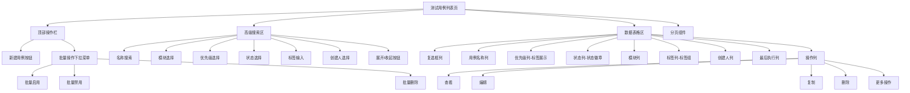

# UI自动化测试平台实施计划

## 一、项目概述

### 1.1 项目目标
基于现有的test-galaxy项目（FastAPI + Vue3技术栈），构建一个完整的UI自动化测试平台，支持测试用例管理、自动化执行和结果报告分析。

### 1.2 技术栈
- 后端：FastAPI + Python 3.13 + MySQL 8.0 + Tortoise ORM
- 前端：Vue 3 + Element Plus + Pinia + Vue Router
- 自动化工具：Playwright Python库（直接集成）
- 包管理：pnpm（前端）+ pip（后端）

### 1.3 核心功能模块
1. 测试用户管理模块
2. 页面元素维护模块
3. 测试用例管理模块
4. 测试套件管理模块
5. 测试单管理模块
6. 测试报告查看模块

## 二、整体实施策略

### 2.1 分阶段实施原则
- 按模块独立性从低到高的顺序实施
- 优先实现基础数据管理功能
- 逐步增加复杂业务逻辑
- 每个阶段完成后进行集成测试

### 2.2 开发顺序规划


### 2.3 技术风险评估

| 风险项 | 风险等级 | 应对策略 |
|--------|----------|----------|
| Playwright集成复杂度 | 低 | 直接使用Playwright Python库，API成熟稳定 |
| 动态筛选条件实现 | 中 | 使用JSON字段存储，后端动态构建查询 |
| 异步执行管理 | 高 | 引入后台任务队列（利用现有background_task） |
| 大量测试用例执行性能 | 中 | 分批执行、进度实时更新 |

## 三、阶段一：数据库初始化与模型定义

### 3.1 目标
创建所有必要的数据库表结构和ORM模型定义。

### 3.2 数据库表设计

#### 3.2.1 核心表清单
1. test_common_users - 测试用户表
2. test_ui_elements - 页面元素表
3. test_ui_element_permissions - 元素权限关联表
4. test_ui_cases - 测试用例表
5. test_ui_case_permissions - 用例权限关联表
6. test_ui_steps - 测试步骤表
7. test_ui_case_suites - 测试套件表
8. test_ui_cases_suites_relation - 套件用例关联表
9. test_ui_tasks - 测试单表
10. test_ui_task_contents - 测试单内容表
11. test_ui_reports - 测试报告表
12. test_ui_case_execution_records - 用例执行记录表
13. test_ui_case_step_execution_records - 步骤执行记录表

#### 3.2.2 表关系图


### 3.3 ORM模型设计规范

#### 3.3.1 模型文件组织
- 位置：backend/app/models/
- 文件命名：ui_test.py（集中管理所有UI测试相关模型）
- 继承基类：参考现有base.py的BaseModel模式

#### 3.3.2 模型字段规范
- 主键：使用BIGINT类型自增ID
- 时间字段：created_time、updated_time自动管理
- 创建人字段：created_by关联当前登录用户
- JSON字段：使用JSONField存储复杂结构（tags、filter_conditions、execute_config、report_data）
- 枚举字段：使用IntEnum或StrEnum定义清晰的状态值

#### 3.3.3 关键字段说明

**test_ui_elements表**
- selector_type：定位器类型（ID/NAME/CSS/XPATH/CLASS_NAME/TAG_NAME/LINK_TEXT/PARTIAL_LINK_TEXT/TEST_ID）
- selector_value：定位器值，最大500字符

**test_ui_steps表**
- action：操作类型（navigate、click、type、select、wait、assert、screenshot等）
- sort_order：步骤排序字段

**test_ui_case_suites表**
- filter_conditions：JSON格式存储筛选条件
  ```json
  {
    "module": ["用户模块", "订单模块"],
    "priority": ["高", "中"],
    "tags": ["smoke", "regression"],
    "created_by": ["user1"]
  }
  ```

**test_ui_tasks表**
- execute_config：JSON格式存储执行配置
  ```json
  {
    "browser": "chromium",
    "timeout": 30000,
    "continue_on_failure": true,
    "retry_count": 2,
    "auto_screenshot": true
  }
  ```

**test_ui_reports表**
- report_data：JSON格式存储详细报告
  ```json
  {
    "environment": "测试环境",
    "browser": "chromium",
    "case_details": [],
    "failure_analysis": {}
  }
  ```

### 3.4 数据库迁移策略
- 使用Aerich进行数据库迁移管理（参考现有migrations目录）
- 创建初始化迁移文件
- 支持版本回滚

### 3.5 Schema设计规范

#### 3.5.1 Schema文件组织
- 位置：backend/app/schemas/
- 文件命名：ui_test.py
- 设计原则：请求/响应分离，复用基础Schema

#### 3.5.2 通用Schema模式
- BaseSchema：基础字段（id、created_time、updated_time）
- CreateSchema：创建请求（不含id和时间字段）
- UpdateSchema：更新请求（部分字段可选）
- ResponseSchema：响应数据（完整字段 + 关联数据）
- ListResponseSchema：列表响应（包含分页信息）

## 四、阶段二：测试用户管理模块

### 4.1 功能范围
管理被测系统的业务用户账号信息，为测试用例执行提供用户凭证。

### 4.2 后端API设计

#### 4.2.1 API端点清单

| 方法 | 路径 | 功能 | 请求体 | 响应 |
|------|------|------|--------|------|
| GET | /api/test-users | 获取测试用户列表 | Query参数 | 分页用户列表 |
| GET | /api/test-users/{id} | 获取单个测试用户 | 无 | 用户详情 |
| POST | /api/test-users | 创建测试用户 | 用户信息 | 创建成功的用户 |
| PUT | /api/test-users/{id} | 更新测试用户 | 用户信息 | 更新后的用户 |
| DELETE | /api/test-users/{id} | 删除测试用户 | 无 | 删除结果 |
| GET | /api/test-users/products | 获取产品列表 | 无 | 去重的产品列表 |
| GET | /api/test-users/roles | 获取角色列表 | 无 | 去重的角色列表 |

#### 4.2.2 查询参数设计
```
GET /api/test-users?page=1&page_size=20&username=admin&product=测试产品&role_name=VIP会员
```

参数说明：
- page：页码（默认1）
- page_size：每页条数（默认20）
- username：用户名模糊搜索
- product：产品名称精确匹配
- role_name：角色名称精确匹配

#### 4.2.3 请求/响应数据结构

**创建/更新请求**
```json
{
  "username": "test_user_001",
  "password": "Test@123456",
  "product": "电商平台",
  "role_name": "VIP会员",
  "description": "用于测试VIP会员专属功能"
}
```

**响应数据**
```json
{
  "id": 1,
  "username": "test_user_001",
  "password": "******",
  "product": "电商平台",
  "role_name": "VIP会员",
  "description": "用于测试VIP会员专属功能",
  "created_by": "admin",
  "created_time": "2024-01-15 10:30:00",
  "updated_time": "2024-01-15 10:30:00"
}
```

**列表响应**
```json
{
  "code": 200,
  "message": "success",
  "data": {
    "items": [...],
    "total": 100,
    "page": 1,
    "page_size": 20,
    "pages": 5
  }
}
```

### 4.3 前端页面设计

#### 4.3.1 页面路由
- 路径：/ui-test/test-users
- 组件位置：frontend/src/views/UITest/TestUsers.vue

#### 4.3.2 页面布局结构


#### 4.3.3 表单字段设计

| 字段名 | 类型 | 必填 | 验证规则 | 说明 |
|--------|------|------|----------|------|
| username | 输入框 | 是 | 长度2-100，唯一性 | 用户名 |
| password | 密码框 | 是 | 长度6-255，复杂度校验 | 支持明文/密文切换 |
| product | 输入框+下拉 | 是 | 长度1-100 | 支持选择或手动输入 |
| role_name | 输入框+下拉 | 是 | 长度1-100 | 支持选择或手动输入 |
| description | 文本域 | 否 | 最大500字符 | 用户描述 |

#### 4.3.4 交互行为规范

**密码显示切换**
- 列表页：默认显示为"******"
- 提供"眼睛"图标按钮，点击切换明文/密文
- 编辑时：可查看原密码或输入新密码

**产品/角色选择器**
- 支持从已有选项中选择
- 支持手动输入新值
- 自动完成提示

**删除确认**
- 弹出二次确认对话框
- 提示"删除后不可恢复，是否确认删除？"
- 检查是否有关联的权限配置

**权限关联查看**
- 点击"查看权限"按钮
- 侧边抽屉展示：
  - 该角色关联的页面元素列表
  - 该角色可执行的测试用例列表

### 4.4 业务逻辑规则

#### 4.4.1 数据验证规则
- 用户名不能重复（同一产品下）
- 密码必须包含大小写字母、数字
- 产品和角色名称不能为空

#### 4.4.2 权限控制
- 只有管理员可以创建/编辑/删除测试用户
- 创建人字段自动记录当前登录用户

#### 4.4.3 关联检查
- 删除前检查是否有元素权限关联
- 删除前检查是否有用例权限关联
- 如有关联，提示先解除关联关系

## 五、阶段三：页面元素维护模块

### 5.1 功能范围
维护被测系统所有页面的UI元素定位信息，支持元素权限管理和关联查询。

### 5.2 后端API设计

#### 5.2.1 API端点清单

| 方法 | 路径 | 功能 | 请求体 | 响应 |
|------|------|------|--------|------|
| GET | /api/ui-elements | 获取元素列表 | Query参数 | 分页元素列表 |
| GET | /api/ui-elements/{id} | 获取单个元素 | 无 | 元素详情 |
| POST | /api/ui-elements | 创建元素 | 元素信息 | 创建成功的元素 |
| PUT | /api/ui-elements/{id} | 更新元素 | 元素信息 | 更新后的元素 |
| DELETE | /api/ui-elements/{id} | 删除元素 | 无 | 删除结果 |
| POST | /api/ui-elements/batch | 批量创建元素 | 元素数组 | 批量创建结果 |
| GET | /api/ui-elements/{id}/related-cases | 获取关联用例 | 无 | 引用该元素的用例列表 |
| GET | /api/ui-elements/{id}/permissions | 获取元素权限 | 无 | 权限角色列表 |
| POST | /api/ui-elements/{id}/permissions | 设置元素权限 | 角色数组 | 设置结果 |
| GET | /api/ui-elements/pages | 获取页面列表 | 无 | 去重的页面列表 |
| GET | /api/ui-elements/modules | 获取模块列表 | 无 | 去重的模块列表 |

#### 5.2.2 查询参数设计
```
GET /api/ui-elements?page=1&page_size=20&name=登录按钮&page=/login&module=用户模块&selector_type=ID
```

参数说明：
- name：元素名称模糊搜索
- page：所属页面精确匹配
- module：所属模块精确匹配
- selector_type：定位器类型精确匹配

#### 5.2.3 请求/响应数据结构

**创建/更新请求**
```json
{
  "name": "用户名输入框",
  "selector_type": "ID",
  "selector_value": "username",
  "description": "登录页面的用户名输入框",
  "page": "/login",
  "module": "用户模块"
}
```

**响应数据（包含关联信息）**
```json
{
  "id": 1,
  "name": "用户名输入框",
  "selector_type": "ID",
  "selector_value": "username",
  "description": "登录页面的用户名输入框",
  "page": "/login",
  "module": "用户模块",
  "created_by": "admin",
  "created_time": "2024-01-15 10:30:00",
  "updated_time": "2024-01-15 10:30:00",
  "related_cases_count": 5,
  "permission_roles": ["VIP会员", "普通会员"]
}
```

**权限设置请求**
```json
{
  "roles": ["VIP会员", "管理员"]
}
```

### 5.3 前端页面设计

#### 5.3.1 页面路由
- 路径：/ui-test/elements
- 组件位置：frontend/src/views/UITest/Elements.vue

#### 5.3.2 页面布局结构


#### 5.3.3 表单字段设计

| 字段名 | 类型 | 必填 | 验证规则 | 说明 |
|--------|------|------|----------|------|
| name | 输入框 | 是 | 长度1-100 | 元素名称 |
| selector_type | 下拉选择 | 是 | 枚举值 | 定位器类型 |
| selector_value | 输入框 | 是 | 长度1-500 | 定位器值 |
| page | 输入框+下拉 | 是 | 长度1-500 | 所属页面URL |
| module | 输入框+下拉 | 否 | 长度1-100 | 所属模块 |
| description | 文本域 | 否 | 最大1000字符 | 元素描述 |

#### 5.3.4 定位器类型选项
- ID
- NAME
- CSS
- XPATH
- CLASS_NAME
- TAG_NAME
- LINK_TEXT
- PARTIAL_LINK_TEXT
- TEST_ID

#### 5.3.5 交互行为规范

**批量导入功能**
- 下载Excel模板
- 上传填写好的Excel文件
- 后端解析验证数据
- 批量创建元素

**定位器值输入辅助**
- 根据定位器类型显示示例
- 提供语法提示

**关联用例查看**
- 侧边抽屉展示
- 显示用例名称、用例ID、引用步骤
- 点击可跳转到用例详情

**权限设置**
- 侧边抽屉展示
- 穿梭框选择角色
- 左侧：所有可用角色
- 右侧：已选中角色
- 保存后更新权限关联表

### 5.4 业务逻辑规则

#### 5.4.1 数据验证规则
- 同一页面下元素名称不能重复
- selector_value根据selector_type进行格式验证
  - XPATH：必须以/或//开头
  - CSS：基本CSS选择器语法验证
  - ID/NAME：不能包含空格

#### 5.4.2 删除限制
- 检查是否被测试步骤引用
- 如被引用，提示"该元素已被X个测试用例引用，无法删除"
- 提供"查看引用"链接

#### 5.4.3 权限管理规则
- 支持为元素设置多个权限角色
- 权限角色来源于test_common_users表的role_name字段
- 权限设置后，在用例执行时校验用户角色是否匹配

## 六、阶段四：测试用例管理模块

### 6.1 功能范围
创建、编辑和管理测试用例，包括测试步骤编排、权限关联和执行历史查看。

### 6.2 后端API设计

#### 6.2.1 API端点清单

| 方法 | 路径 | 功能 | 请求体 | 响应 |
|------|------|------|--------|------|
| GET | /api/test-cases | 获取用例列表 | Query参数 | 分页用例列表 |
| GET | /api/test-cases/{id} | 获取用例详情 | 无 | 用例完整信息 |
| POST | /api/test-cases | 创建用例 | 用例信息 | 创建成功的用例 |
| PUT | /api/test-cases/{id} | 更新用例 | 用例信息 | 更新后的用例 |
| DELETE | /api/test-cases/{id} | 删除用例 | 无 | 删除结果 |
| POST | /api/test-cases/{id}/copy | 复制用例 | 无 | 新用例 |
| PATCH | /api/test-cases/{id}/status | 更新用例状态 | 状态值 | 更新结果 |
| GET | /api/test-cases/{id}/steps | 获取测试步骤 | 无 | 步骤列表 |
| POST | /api/test-cases/{id}/steps | 创建测试步骤 | 步骤信息 | 创建的步骤 |
| PUT | /api/test-steps/{step_id} | 更新测试步骤 | 步骤信息 | 更新的步骤 |
| DELETE | /api/test-steps/{step_id} | 删除测试步骤 | 无 | 删除结果 |
| POST | /api/test-cases/{id}/steps/reorder | 调整步骤顺序 | 步骤ID数组 | 更新结果 |
| GET | /api/test-cases/{id}/permissions | 获取用例权限 | 无 | 权限角色列表 |
| POST | /api/test-cases/{id}/permissions | 设置用例权限 | 角色数组 | 设置结果 |
| GET | /api/test-cases/{id}/executions | 获取执行历史 | Query参数 | 执行记录列表 |
| GET | /api/test-cases/{id}/execution-trend | 获取执行趋势 | Query参数 | 趋势统计数据 |
| POST | /api/test-cases/batch-update-status | 批量更新状态 | 用例ID数组+状态 | 更新结果 |

#### 6.2.2 查询参数设计
```
GET /api/test-cases?page=1&page_size=20&name=登录&module=用户模块&priority=高&status=激活&tags=smoke,regression&created_by=admin
```

参数说明：
- name：用例名称模糊搜索
- module：所属模块精确匹配
- priority：优先级（高/中/低）
- status：状态（草稿/激活/禁用/归档）
- tags：标签（逗号分隔，OR关系）
- created_by：创建人

#### 6.2.3 请求/响应数据结构

**创建/更新用例请求**
```json
{
  "name": "用户登录功能测试",
  "description": "验证用户使用正确账号密码登录系统",
  "priority": "高",
  "module": "用户模块",
  "tags": ["smoke", "regression"],
  "status": "激活",
  "precondition": "系统已启动，数据库中存在测试用户",
  "expected_result": "登录成功，跳转到首页"
}
```

**用例详情响应**
```json
{
  "id": 1,
  "name": "用户登录功能测试",
  "description": "验证用户使用正确账号密码登录系统",
  "priority": "高",
  "module": "用户模块",
  "tags": ["smoke", "regression"],
  "status": "激活",
  "precondition": "系统已启动，数据库中存在测试用户",
  "expected_result": "登录成功，跳转到首页",
  "created_by": "admin",
  "created_time": "2024-01-15 10:30:00",
  "updated_time": "2024-01-15 10:30:00",
  "steps": [...],
  "permission_roles": ["VIP会员", "普通会员"],
  "execution_count": 10,
  "last_execution_status": "通过",
  "last_execution_time": "2024-01-20 14:30:00"
}
```

**测试步骤数据结构**
```json
{
  "id": 1,
  "test_case_id": 1,
  "step_number": 1,
  "action": "navigate",
  "element_id": null,
  "input_data": "http://localhost:5173/login",
  "wait_time": 2000,
  "description": "打开登录页面",
  "sort_order": 1
}
```

**步骤重排序请求**
```json
{
  "step_ids": [3, 1, 2, 4]
}
```

**执行历史响应**
```json
{
  "items": [
    {
      "id": 100,
      "test_case_id": 1,
      "test_report_id": 50,
      "test_task_name": "回归测试-2024-01-20",
      "status": "通过",
      "start_time": "2024-01-20 14:30:00",
      "end_time": "2024-01-20 14:31:30",
      "duration": 90,
      "error_message": null,
      "screenshot_path": null
    }
  ],
  "total": 10
}
```

**执行趋势数据**
```json
{
  "pass_rate_trend": [
    {"date": "2024-01-15", "pass_rate": 100.0},
    {"date": "2024-01-16", "pass_rate": 90.0}
  ],
  "avg_duration_trend": [
    {"date": "2024-01-15", "avg_duration": 85},
    {"date": "2024-01-16", "avg_duration": 90}
  ],
  "failure_reasons": {
    "元素未找到": 3,
    "超时": 2,
    "断言失败": 1
  }
}
```

### 6.3 前端页面设计

#### 6.3.1 页面路由
- 列表页：/ui-test/test-cases
- 详情/编辑页：/ui-test/test-cases/:id
- 新建页：/ui-test/test-cases/new

#### 6.3.2 用例列表页布局


#### 6.3.3 用例编辑页布局


#### 6.3.4 表单字段设计

**基本信息字段**

| 字段名 | 类型 | 必填 | 验证规则 | 说明 |
|--------|------|------|----------|------|
| name | 输入框 | 是 | 长度1-200 | 用例名称 |
| description | 文本域 | 否 | 最大2000字符 | 用例描述 |
| priority | 单选按钮组 | 是 | 枚举值 | 高/中/低 |
| module | 输入框+下拉 | 否 | 长度1-100 | 所属模块 |
| tags | 标签输入器 | 否 | 每个标签最大20字符 | 支持新增和选择 |
| status | 下拉选择 | 是 | 枚举值 | 草稿/激活/禁用/归档 |
| precondition | 文本域 | 否 | 最大1000字符 | 前置条件 |
| expected_result | 文本域 | 否 | 最大1000字符 | 预期结果 |

**测试步骤字段**

| 字段名 | 类型 | 必填 | 验证规则 | 说明 |
|--------|------|------|----------|------|
| action | 下拉选择 | 是 | 枚举值 | 操作类型 |
| element_id | 元素选择器 | 条件必填 | 有效的元素ID | 部分操作需要 |
| input_data | 输入框 | 条件必填 | 最大500字符 | 部分操作需要 |
| wait_time | 数字输入框 | 否 | 0-60000毫秒 | 等待时间 |
| description | 输入框 | 是 | 长度1-500 | 步骤描述 |

#### 6.3.5 操作类型定义

| 操作类型 | 英文标识 | 需要元素 | 需要输入数据 | 说明 |
|----------|----------|----------|--------------|------|
| 页面导航 | navigate | 否 | 是 | input_data为URL |
| 点击 | click | 是 | 否 | 点击指定元素 |
| 输入文本 | type | 是 | 是 | 在元素中输入文本 |
| 选择下拉 | select | 是 | 是 | 选择下拉选项 |
| 等待 | wait | 否 | 否 | 等待指定时间 |
| 等待元素出现 | wait_for_element | 是 | 否 | 等待元素可见 |
| 断言文本 | assert_text | 是 | 是 | 验证元素文本 |
| 断言存在 | assert_exists | 是 | 否 | 验证元素存在 |
| 截图 | screenshot | 否 | 否 | 截取当前页面 |
| 悬停 | hover | 是 | 否 | 鼠标悬停在元素上 |
| 清空输入 | clear | 是 | 否 | 清空输入框内容 |
| 执行脚本 | execute_script | 否 | 是 | 执行JavaScript代码 |
| 切换框架 | switch_frame | 是 | 否 | 切换到iframe |
| 返回上一页 | go_back | 否 | 否 | 浏览器返回 |
| 刷新页面 | refresh | 否 | 否 | 刷新当前页面 |

#### 6.3.6 交互行为规范

**步骤拖拽排序**
- 使用拖拽手柄（六点图标）
- 拖拽时显示拖拽预览
- 放下时自动更新步骤编号
- 保存时统一提交新顺序

**元素选择器交互**
- 下拉列表展示所有可用元素
- 支持按元素名称搜索
- 显示元素的定位器类型和值
- 分组显示（按页面或模块）

**步骤复制功能**
- 点击复制按钮
- 在当前步骤下方插入副本
- 副本步骤编号自动调整

**步骤删除功能**
- 点击删除按钮
- 二次确认
- 删除后自动调整编号

**标签输入器**
- 输入后按回车添加
- 显示已有标签的下拉建议
- 点击标签可删除

**执行历史侧边栏**
- 右侧抽屉展示
- 时间轴样式展示历史记录
- 点击记录可查看报告详情
- 展示执行趋势图表

**权限设置**
- 穿梭框组件
- 左侧：所有可用角色
- 右侧：已授权角色

### 6.4 业务逻辑规则

#### 6.4.1 用例状态流转规则


状态说明：
- 草稿：新建状态，可编辑
- 激活：可执行状态
- 禁用：暂停执行，可恢复
- 归档：已废弃，不可执行

#### 6.4.2 步骤验证规则
- 至少包含1个测试步骤
- navigate操作的input_data必须是有效URL
- click、type等操作必须选择元素
- wait_time不能超过60秒
- 步骤描述不能为空

#### 6.4.3 删除限制
- 检查是否被套件引用
- 检查是否有执行记录
- 如被引用，提示"该用例已被X个套件引用"
- 提供"强制删除"选项（同时删除关联关系）

#### 6.4.4 复制规则
- 复制用例基本信息
- 复制所有测试步骤
- 新用例名称自动添加"副本"后缀
- 新用例状态默认为"草稿"
- 不复制执行历史
- 不复制权限设置

### 6.5 执行历史功能设计

#### 6.5.1 历史记录页面
- 路径：/ui-test/test-cases/:id/executions
- 展示单个用例的所有执行记录

#### 6.5.2 页面内容
- 用例基本信息头部
- 历史执行记录表格
  - 执行时间
  - 所属测试单
  - 执行结果（通过/失败/跳过/中断）
  - 执行耗时
  - 错误信息摘要
  - 操作（查看详情/查看截图）
- 执行趋势图表
  - 成功率趋势线图（最近30次）
  - 平均执行时间柱状图
  - 失败原因分布饼图

## 七、阶段五：测试套件管理模块

### 7.1 功能范围
通过动态筛选条件创建测试套件，组合多个测试用例形成测试集合。

### 7.2 后端API设计

#### 7.2.1 API端点清单

| 方法 | 路径 | 功能 | 请求体 | 响应 |
|------|------|------|--------|------|
| GET | /api/test-suites | 获取套件列表 | Query参数 | 分页套件列表 |
| GET | /api/test-suites/{id} | 获取套件详情 | 无 | 套件完整信息 |
| POST | /api/test-suites | 创建套件 | 套件信息 | 创建的套件 |
| PUT | /api/test-suites/{id} | 更新套件 | 套件信息 | 更新的套件 |
| DELETE | /api/test-suites/{id} | 删除套件 | 无 | 删除结果 |
| POST | /api/test-suites/{id}/preview | 预览匹配用例 | 筛选条件 | 匹配的用例列表 |
| GET | /api/test-suites/{id}/cases | 获取套件用例 | 无 | 用例列表 |
| POST | /api/test-suites/{id}/cases | 添加用例到套件 | 用例ID数组 | 添加结果 |
| DELETE | /api/test-suites/{id}/cases/{case_id} | 从套件移除用例 | 无 | 移除结果 |
| POST | /api/test-suites/{id}/cases/reorder | 调整用例顺序 | 用例ID数组 | 更新结果 |
| POST | /api/test-suites/{id}/sync | 同步筛选条件 | 无 | 同步结果 |

#### 7.2.2 查询参数设计
```
GET /api/test-suites?page=1&page_size=20&name=回归测试&created_by=admin
```

#### 7.2.3 请求/响应数据结构

**创建/更新套件请求**
```json
{
  "name": "登录模块回归测试套件",
  "description": "包含所有登录相关的测试用例",
  "filter_conditions": {
    "module": ["用户模块"],
    "priority": ["高", "中"],
    "tags": ["smoke", "regression"],
    "status": ["激活"]
  }
}
```

**套件详情响应**
```json
{
  "id": 1,
  "name": "登录模块回归测试套件",
  "description": "包含所有登录相关的测试用例",
  "filter_conditions": {
    "module": ["用户模块"],
    "priority": ["高", "中"],
    "tags": ["smoke", "regression"],
    "status": ["激活"]
  },
  "created_by": "admin",
  "created_time": "2024-01-15 10:30:00",
  "updated_time": "2024-01-15 10:30:00",
  "case_count": 15,
  "cases": [...]
}
```

**预览匹配用例响应**
```json
{
  "matched_count": 15,
  "cases": [
    {
      "id": 1,
      "name": "用户登录功能测试",
      "priority": "高",
      "module": "用户模块",
      "tags": ["smoke", "regression"],
      "status": "激活"
    }
  ]
}
```

### 7.3 前端页面设计

#### 7.3.1 页面路由
- 列表页：/ui-test/test-suites
- 编辑页：/ui-test/test-suites/:id

#### 7.3.2 套件列表页布局


#### 7.3.3 套件编辑页布局


#### 7.3.4 表单字段设计

| 字段名 | 类型 | 必填 | 验证规则 | 说明 |
|--------|------|------|----------|------|
| name | 输入框 | 是 | 长度1-200 | 套件名称 |
| description | 文本域 | 否 | 最大1000字符 | 套件描述 |
| filter_conditions | 筛选构建器 | 否 | JSON对象 | 动态筛选条件 |

#### 7.3.5 筛选条件构建器设计

**筛选条件数据结构**
```json
{
  "module": ["用户模块", "订单模块"],
  "priority": ["高"],
  "tags": ["smoke"],
  "status": ["激活"],
  "created_by": ["admin", "tester1"]
}
```

**筛选逻辑**
- 同一字段内多个值：OR关系（例如：module包含"用户模块"或"订单模块"）
- 不同字段之间：AND关系（例如：module符合 且 priority符合）
- tags字段：用例的tags包含筛选条件中的任意一个标签即匹配

**实时匹配机制**
- 用户每次修改筛选条件后
- 防抖延迟500ms
- 调用预览接口获取匹配数量和用例列表
- 更新"当前筛选条件匹配X个用例"提示

#### 7.3.6 交互行为规范

**筛选条件联动**
- 修改筛选条件时实时预览
- 显示"正在匹配..."加载状态
- 匹配结果展示在右侧预览区

**从匹配结果添加**
- 预览区显示匹配的用例列表
- 每个用例有"添加"按钮
- 点击添加后移入右侧已选列表
- 已添加的用例显示"已添加"状态

**手动管理用例**
- 支持拖拽调整执行顺序
- 点击移除按钮从套件移除
- 提供"清空所有"按钮

**保存并同步**
- 保存套件基本信息和筛选条件
- 清空已有用例关联
- 根据最新筛选条件重新匹配并添加用例
- 适用于希望套件始终包含符合条件的最新用例

**仅保存**
- 保存套件基本信息和筛选条件
- 不改变现有用例关联
- 适用于手动管理用例的场景

### 7.4 业务逻辑规则

#### 7.4.1 筛选条件执行逻辑
- 后端根据filter_conditions动态构建ORM查询
- 空的筛选条件字段不参与过滤
- 仅筛选状态为"激活"的用例（可通过status字段覆盖）

#### 7.4.2 用例关联管理
- 支持两种模式：
  1. 动态模式：完全依赖筛选条件，每次同步时重新匹配
  2. 静态模式：手动添加/移除，不受筛选条件影响
- 推荐使用混合模式：先通过筛选添加，再手动微调

#### 7.4.3 删除限制
- 检查是否被测试单引用
- 如被引用，提示"该套件已被X个测试单使用"
- 提供"强制删除"选项

## 八、阶段六：测试单管理模块

### 8.1 功能范围
创建测试任务，配置执行策略，组合测试套件和用例，管理执行进度。

### 8.2 后端API设计

#### 8.2.1 API端点清单

| 方法 | 路径 | 功能 | 请求体 | 响应 |
|------|------|------|--------|------|
| GET | /api/test-tasks | 获取测试单列表 | Query参数 | 分页测试单列表 |
| GET | /api/test-tasks/{id} | 获取测试单详情 | 无 | 测试单完整信息 |
| POST | /api/test-tasks | 创建测试单 | 测试单信息 | 创建的测试单 |
| PUT | /api/test-tasks/{id} | 更新测试单 | 测试单信息 | 更新的测试单 |
| DELETE | /api/test-tasks/{id} | 删除测试单 | 无 | 删除结果 |
| POST | /api/test-tasks/{id}/execute | 立即执行测试单 | 无 | 执行结果 |
| POST | /api/test-tasks/{id}/cancel | 取消执行 | 无 | 取消结果 |
| GET | /api/test-tasks/{id}/progress | 获取执行进度 | 无 | 进度信息 |
| GET | /api/test-tasks/{id}/estimate | 获取预计时间 | 无 | 时间估算 |
| GET | /api/test-tasks/{id}/contents | 获取测试内容 | 无 | 套件和用例列表 |
| POST | /api/test-tasks/{id}/contents | 添加测试内容 | 内容数组 | 添加结果 |
| DELETE | /api/test-tasks/{id}/contents/{content_id} | 移除测试内容 | 无 | 移除结果 |
| POST | /api/test-tasks/{id}/contents/reorder | 调整执行顺序 | 内容ID数组 | 更新结果 |
| POST | /api/test-tasks/{id}/schedule | 设置定时执行 | 定时配置 | 设置结果 |
| GET | /api/test-tasks/{id}/reports | 获取执行报告列表 | 无 | 报告列表 |

#### 8.2.2 查询参数设计
```
GET /api/test-tasks?page=1&page_size=20&name=回归测试&status=执行中&environment=测试环境&created_by=admin
```

参数说明：
- name：测试单名称模糊搜索
- status：状态（待执行/执行中/已完成/已取消/执行失败）
- environment：测试环境
- created_by：创建人

#### 8.2.3 请求/响应数据结构

**创建/更新测试单请求**
```json
{
  "name": "登录模块回归测试-2024-01-20",
  "description": "验证登录模块核心功能",
  "environment": "测试环境",
  "execute_config": {
    "browser": "chromium",
    "timeout": 30000,
    "continue_on_failure": true,
    "retry_count": 2,
    "auto_screenshot": true
  }
}
```

**测试单详情响应**
```json
{
  "id": 1,
  "name": "登录模块回归测试-2024-01-20",
  "description": "验证登录模块核心功能",
  "environment": "测试环境",
  "status": "执行中",
  "execute_config": {...},
  "created_by": "admin",
  "created_time": "2024-01-20 10:00:00",
  "start_time": "2024-01-20 10:05:00",
  "end_time": null,
  "total_cases": 20,
  "executed_cases": 10,
  "passed_cases": 8,
  "failed_cases": 2,
  "progress": 50.0,
  "estimated_duration": 600,
  "remaining_time": 300
}
```

**添加测试内容请求**
```json
{
  "contents": [
    {
      "item_type": "SUITE",
      "item_id": 1
    },
    {
      "item_type": "CASE",
      "item_id": 5
    }
  ]
}
```

**执行进度响应**
```json
{
  "status": "执行中",
  "total_cases": 20,
  "executed_cases": 10,
  "passed_cases": 8,
  "failed_cases": 2,
  "skipped_cases": 0,
  "progress": 50.0,
  "current_case_name": "用户登录功能测试",
  "start_time": "2024-01-20 10:05:00",
  "elapsed_time": 300,
  "estimated_total_time": 600,
  "remaining_time": 300
}
```

**时间估算响应**
```json
{
  "total_cases": 20,
  "estimated_duration": 600,
  "estimation_basis": "基于历史执行记录平均值"
}
```

### 8.3 前端页面设计

#### 8.3.1 页面路由
- 列表页：/ui-test/test-tasks
- 详情/编辑页：/ui-test/test-tasks/:id
- 新建页：/ui-test/test-tasks/new

#### 8.3.2 测试单列表页布局


#### 8.3.3 测试单编辑页布局


#### 8.3.4 表单字段设计

**基本信息字段**

| 字段名 | 类型 | 必填 | 验证规则 | 说明 |
|--------|------|------|----------|------|
| name | 输入框 | 是 | 长度1-200 | 测试单名称 |
| description | 文本域 | 否 | 最大1000字符 | 描述 |
| environment | 输入框+下拉 | 是 | 长度1-100 | 测试环境 |

**执行配置字段**

| 字段名 | 类型 | 默认值 | 说明 |
|--------|------|--------|------|
| browser | 单选按钮组 | chromium | chromium/firefox/webkit |
| timeout | 数字输入框 | 30000 | 单步超时时间（毫秒） |
| continue_on_failure | 开关 | true | 失败后是否继续 |
| retry_count | 数字输入框 | 0 | 失败重试次数（0-3次） |
| auto_screenshot | 开关 | true | 失败时自动截图 |

#### 8.3.5 测试内容选择逻辑

**套件选择**
- 显示所有可用套件
- 显示套件包含的用例数量
- 添加套件时自动展开为用例列表
- 如果套件用例已存在，跳过重复添加

**用例选择**
- 支持高级搜索（模块、优先级、标签）
- 显示用例基本信息
- 显示历史平均执行时间
- 支持批量选择

**去重逻辑**
- 同一用例只能添加一次
- 添加套件时检查用例是否已存在
- 已存在的用例不重复添加

#### 8.3.6 执行进度展示

**进度条组件**
- 总进度百分比
- 分段显示：通过（绿色）/失败（红色）/待执行（灰色）
- 显示数量统计：10/20（已执行/总数）

**实时更新机制**
- WebSocket连接或轮询（间隔2秒）
- 更新执行进度数据
- 更新当前执行用例名称
- 更新剩余时间估算

**执行详情页**
- 展示实时执行日志
- 显示每个用例的执行状态
- 失败用例高亮显示
- 点击查看失败详情和截图

### 8.4 业务逻辑规则

#### 8.4.1 测试单状态流转


#### 8.4.2 执行顺序规则
- 按照test_ui_task_contents表的sort_order字段排序
- 套件类型：展开为用例列表后按套件内顺序执行
- 用例类型：直接执行

#### 8.4.3 失败处理策略
- continue_on_failure=true：记录失败，继续执行下一个用例
- continue_on_failure=false：记录失败，终止整个测试单
- retry_count>0：失败后重试指定次数，仍失败则按continue_on_failure处理

#### 8.4.4 时间估算算法
- 查询每个用例的历史执行记录
- 计算平均执行时间
- 无历史记录的用例使用默认值（30秒）
- 汇总所有用例时间作为预计执行时间
- 执行过程中动态计算剩余时间

#### 8.4.5 定时执行功能
- 支持设置执行时间
- 使用后台任务调度（APScheduler或类似工具）
- 到达时间自动触发执行
- 支持取消定时任务

## 九、阶段七：自动化执行引擎

### 9.1 功能范围
核心执行引擎，负责调用Playwright执行测试用例，记录执行结果，生成执行记录。

### 9.2 架构设计

#### 9.2.1 执行引擎组件结构


### 9.3 核心模块设计

#### 9.3.1 测试单执行调度器

**功能**
- 接收测试单执行请求
- 加载测试单配置和内容
- 创建执行报告记录
- 按顺序调度用例执行器
- 处理失败策略和重试逻辑
- 更新测试单状态
- 汇总执行结果

**执行流程**


**关键逻辑**
- 异步执行：使用后台任务（backend/app/core/background_task.py）
- 状态管理：执行前、执行中、执行后状态更新
- 异常处理：捕获执行异常，记录错误信息，优雅降级
- 进度跟踪：实时更新已执行用例数、通过数、失败数

#### 9.3.2 用例执行器

**功能**
- 加载用例基本信息和测试步骤
- 验证用户权限（如配置了权限）
- 初始化浏览器会话
- 按顺序执行测试步骤
- 处理步骤执行异常
- 验证预期结果
- 记录执行时间和结果

**执行流程**


**关键逻辑**
- 权限验证：如果用例配置了权限角色，从test_common_users中查找匹配角色的用户
- 超时控制：每个步骤受config.timeout限制
- 重试机制：步骤失败时根据config.retry_count重试
- 截图时机：步骤失败、用例失败时（如开启auto_screenshot）
- 结果判定：所有步骤通过则用例通过，任一步骤失败则用例失败

#### 9.3.3 步骤执行器

**功能**
- 解析步骤操作类型
- 加载元素定位信息（如需要）
- 调用Playwright Python API执行操作
- 处理操作响应
- 返回执行结果

**操作类型映射（Playwright Python API）**

| 操作类型 | Playwright API | 示例调用 |
|----------|---------------|----------|
| navigate | page.goto(url) | page.goto('http://example.com') |
| click | page.click(selector) | page.click('#submit-btn') |
| type | page.fill(selector, text) | page.fill('#username', 'admin') |
| select | page.select_option(selector, value) | page.select_option('#country', 'CN') |
| wait | page.wait_for_timeout(ms) | page.wait_for_timeout(2000) |
| wait_for_element | page.wait_for_selector(selector) | page.wait_for_selector('#loaded') |
| assert_text | page.text_content(selector) | assert page.text_content('#msg') == '成功' |
| assert_exists | page.is_visible(selector) | assert page.is_visible('#element') |
| screenshot | page.screenshot(path=...) | page.screenshot(path='screenshot.png') |
| hover | page.hover(selector) | page.hover('.menu-item') |
| clear | page.fill(selector, '') | page.fill('#input', '') |
| execute_script | page.evaluate(script) | page.evaluate('window.scrollTo(0, 100)') |
| switch_frame | page.frame(name_or_url) | frame = page.frame('iframe-name') |
| go_back | page.go_back() | page.go_back() |
| refresh | page.reload() | page.reload() |

**元素定位转换**
- 从test_ui_elements表查询元素的selector_type和selector_value
- 转换为Playwright选择器格式：
  - ID → `#value`
  - NAME → `[name="value"]`
  - CSS → 直接使用value
  - XPATH → `xpath=value`
  - CLASS_NAME → `.value`
  - TAG_NAME → `value`
  - LINK_TEXT → `text=value`
  - PARTIAL_LINK_TEXT → `text=/value/`
  - TEST_ID → `[data-testid="value"]`
- 直接调用Playwright Python API执行操作

**关键逻辑**
- 选择器生成：根据selector_type和selector_value动态生成
- 错误捕获：捕获Playwright操作异常（元素未找到、超时等）
- 结果验证：assert类操作需验证结果，不符合预期则返回失败
- 等待策略：操作后自动等待wait_time（如配置）

#### 9.3.4 执行上下文管理器

**功能**
- 管理浏览器实例生命周期

## 一、项目概述

### 1.1 项目目标
基于现有的test-galaxy项目（FastAPI + Vue3技术栈），构建一个完整的UI自动化测试平台，支持测试用例管理、自动化执行和结果报告分析。

### 1.2 技术栈
- 后端：FastAPI + Python 3.13 + MySQL 8.0 + Tortoise ORM
- 前端：Vue 3 + Element Plus + Pinia + Vue Router
- 自动化工具：Playwright Python库（直接集成）
- 包管理：pnpm（前端）+ pip（后端）

### 1.3 核心功能模块
1. 测试用户管理模块
2. 页面元素维护模块
3. 测试用例管理模块
4. 测试套件管理模块
5. 测试单管理模块
6. 测试报告查看模块

## 二、整体实施策略

### 2.1 分阶段实施原则
- 按模块独立性从低到高的顺序实施
- 优先实现基础数据管理功能
- 逐步增加复杂业务逻辑
- 每个阶段完成后进行集成测试

### 2.2 开发顺序规划


### 2.3 技术风险评估

| 风险项 | 风险等级 | 应对策略 |
|--------|----------|----------|
| Playwright集成复杂度 | 低 | 直接使用Playwright Python库，API成熟稳定 |
| 动态筛选条件实现 | 中 | 使用JSON字段存储，后端动态构建查询 |
| 异步执行管理 | 高 | 引入后台任务队列（利用现有background_task） |
| 大量测试用例执行性能 | 中 | 分批执行、进度实时更新 |

## 三、阶段一：数据库初始化与模型定义

### 3.1 目标
创建所有必要的数据库表结构和ORM模型定义。

### 3.2 数据库表设计

#### 3.2.1 核心表清单
1. test_common_users - 测试用户表
2. test_ui_elements - 页面元素表
3. test_ui_element_permissions - 元素权限关联表
4. test_ui_cases - 测试用例表
5. test_ui_case_permissions - 用例权限关联表
6. test_ui_steps - 测试步骤表
7. test_ui_case_suites - 测试套件表
8. test_ui_cases_suites_relation - 套件用例关联表
9. test_ui_tasks - 测试单表
10. test_ui_task_contents - 测试单内容表
11. test_ui_reports - 测试报告表
12. test_ui_case_execution_records - 用例执行记录表
13. test_ui_case_step_execution_records - 步骤执行记录表

#### 3.2.2 表关系图


### 3.3 ORM模型设计规范

#### 3.3.1 模型文件组织
- 位置：backend/app/models/
- 文件命名：ui_test.py（集中管理所有UI测试相关模型）
- 继承基类：参考现有base.py的BaseModel模式

#### 3.3.2 模型字段规范
- 主键：使用BIGINT类型自增ID
- 时间字段：created_time、updated_time自动管理
- 创建人字段：created_by关联当前登录用户
- JSON字段：使用JSONField存储复杂结构（tags、filter_conditions、execute_config、report_data）
- 枚举字段：使用IntEnum或StrEnum定义清晰的状态值

#### 3.3.3 关键字段说明

**test_ui_elements表**
- selector_type：定位器类型（ID/NAME/CSS/XPATH/CLASS_NAME/TAG_NAME/LINK_TEXT/PARTIAL_LINK_TEXT/TEST_ID）
- selector_value：定位器值，最大500字符

**test_ui_steps表**
- action：操作类型（navigate、click、type、select、wait、assert、screenshot等）
- sort_order：步骤排序字段

**test_ui_case_suites表**
- filter_conditions：JSON格式存储筛选条件

**test_ui_tasks表**
- execute_config：JSON格式存储执行配置

**test_ui_reports表**
- report_data：JSON格式存储详细报告

### 3.4 数据库迁移策略
- 使用Aerich进行数据库迁移管理（参考现有migrations目录）
- 创建初始化迁移文件
- 支持版本回滚

### 3.5 Schema设计规范

#### 3.5.1 Schema文件组织
- 位置：backend/app/schemas/
- 文件命名：ui_test.py
- 设计原则：请求/响应分离，复用基础Schema

#### 3.5.2 通用Schema模式
- BaseSchema：基础字段（id、created_time、updated_time）
- CreateSchema：创建请求（不含id和时间字段）
- UpdateSchema：更新请求（部分字段可选）
- ResponseSchema：响应数据（完整字段 + 关联数据）
- ListResponseSchema：列表响应（包含分页信息）

## 四、阶段二：测试用户管理模块实施计划

### 4.1 功能范围
管理被测系统的业务用户账号信息，为测试用例执行提供用户凭证。

### 4.2 后端开发任务

#### 4.2.1 API接口实现

**API端点清单**

| 方法 | 路径 | 功能 |
|------|------|------|
| GET | /api/test-users | 获取测试用户列表（支持分页和筛选） |
| GET | /api/test-users/{id} | 获取单个测试用户详情 |
| POST | /api/test-users | 创建测试用户 |
| PUT | /api/test-users/{id} | 更新测试用户 |
| DELETE | /api/test-users/{id} | 删除测试用户 |
| GET | /api/test-users/products | 获取去重的产品列表 |
| GET | /api/test-users/roles | 获取去重的角色列表 |

#### 4.2.2 业务规则
- 用户名在同一产品下不能重复
- 密码存储需加密处理
- 删除前检查权限关联
- 创建人字段自动记录

### 4.3 前端开发任务

#### 4.3.1 页面组件开发
- 路由：/ui-test/test-users
- 组件：frontend/src/views/UITest/TestUsers.vue

#### 4.3.2 核心功能
- 用户列表展示（表格、分页）
- 搜索筛选（用户名、产品、角色）
- 新增/编辑对话框
- 密码明文/密文切换显示
- 删除确认
- 权限关联查看

### 4.4 验收标准
- 能够完成用户的增删改查操作
- 搜索筛选功能正常
- 密码加密存储且可切换显示
- 删除时正确检查关联关系

## 五、阶段三：页面元素维护模块实施计划

### 5.1 功能范围
维护被测系统所有页面的UI元素定位信息，支持元素权限管理和关联查询。

### 5.2 后端开发任务

#### 5.2.1 API接口实现

**API端点清单**

| 方法 | 路径 | 功能 |
|------|------|------|
| GET | /api/ui-elements | 获取元素列表（支持分页和筛选） |
| GET | /api/ui-elements/{id} | 获取单个元素详情 |
| POST | /api/ui-elements | 创建元素 |
| PUT | /api/ui-elements/{id} | 更新元素 |
| DELETE | /api/ui-elements/{id} | 删除元素 |
| POST | /api/ui-elements/batch | 批量创建元素 |
| GET | /api/ui-elements/{id}/related-cases | 获取引用该元素的用例列表 |
| GET | /api/ui-elements/{id}/permissions | 获取元素权限 |
| POST | /api/ui-elements/{id}/permissions | 设置元素权限 |
| GET | /api/ui-elements/pages | 获取去重的页面列表 |
| GET | /api/ui-elements/modules | 获取去重的模块列表 |

#### 5.2.2 业务规则
- 同一页面下元素名称不能重复
- 删除前检查是否被测试步骤引用
- 支持批量导入（Excel模板）
- 定位器值根据类型进行格式验证

### 5.3 前端开发任务

#### 5.3.1 页面组件开发
- 路由：/ui-test/elements
- 组件：frontend/src/views/UITest/Elements.vue

#### 5.3.2 核心功能
- 元素列表展示（表格、分页）
- 搜索筛选（名称、页面、模块、定位器类型）
- 新增/编辑对话框
- 批量导入（Excel上传）
- 关联用例查看（侧边抽屉）
- 权限设置（穿梭框）

### 5.4 验收标准
- 能够完成元素的增删改查操作
- 批量导入功能正常
- 关联用例查询准确
- 权限设置生效
- 删除时正确检查引用关系

## 六、阶段四：测试用例管理模块实施计划

### 6.1 功能范围
创建、编辑和管理测试用例，包括测试步骤编排、权限关联和执行历史查看。

### 6.2 后端开发任务

#### 6.2.1 API接口实现

**API端点清单**

| 方法 | 路径 | 功能 |
|------|------|------|
| GET | /api/test-cases | 获取用例列表（高级搜索） |
| GET | /api/test-cases/{id} | 获取用例详情（含步骤） |
| POST | /api/test-cases | 创建用例 |
| PUT | /api/test-cases/{id} | 更新用例 |
| DELETE | /api/test-cases/{id} | 删除用例 |
| POST | /api/test-cases/{id}/copy | 复制用例 |
| PATCH | /api/test-cases/{id}/status | 更新用例状态 |
| GET | /api/test-cases/{id}/steps | 获取测试步骤 |
| POST | /api/test-cases/{id}/steps | 创建测试步骤 |
| PUT | /api/test-steps/{step_id} | 更新测试步骤 |
| DELETE | /api/test-steps/{step_id} | 删除测试步骤 |
| POST | /api/test-cases/{id}/steps/reorder | 调整步骤顺序 |
| GET | /api/test-cases/{id}/permissions | 获取用例权限 |
| POST | /api/test-cases/{id}/permissions | 设置用例权限 |
| GET | /api/test-cases/{id}/executions | 获取执行历史 |
| GET | /api/test-cases/{id}/execution-trend | 获取执行趋势统计 |
| POST | /api/test-cases/batch-update-status | 批量更新状态 |

#### 6.2.2 业务规则
- 用例状态流转：草稿→激活→禁用/归档
- 至少包含1个测试步骤
- 步骤支持拖拽排序
- 删除前检查套件引用
- 复制用例时不复制执行历史

### 6.3 前端开发任务

#### 6.3.1 页面组件开发
- 列表页：/ui-test/test-cases
- 编辑页：/ui-test/test-cases/:id
- 历史页：/ui-test/test-cases/:id/executions

#### 6.3.2 核心功能
- 用例列表（高级搜索、批量操作）
- 用例编辑器
  - 基本信息表单
  - 测试步骤可视化编排（拖拽排序）
  - 元素选择器（下拉+搜索）
  - 操作类型选择
- 执行历史展示（时间轴、趋势图表）
- 权限设置
- 复制功能

### 6.4 验收标准
- 能够完成用例的增删改查操作
- 步骤编排功能流畅（拖拽、复制、删除）
- 元素选择器体验良好
- 执行历史数据准确展示
- 状态流转符合规则

## 七、阶段五：测试套件管理模块实施计划

### 7.1 功能范围
通过动态筛选条件创建测试套件，组合多个测试用例形成测试集合。

### 7.2 后端开发任务

#### 7.2.1 API接口实现

**API端点清单**

| 方法 | 路径 | 功能 |
|------|------|------|
| GET | /api/test-suites | 获取套件列表 |
| GET | /api/test-suites/{id} | 获取套件详情 |
| POST | /api/test-suites | 创建套件 |
| PUT | /api/test-suites/{id} | 更新套件 |
| DELETE | /api/test-suites/{id} | 删除套件 |
| POST | /api/test-suites/{id}/preview | 预览匹配用例 |
| GET | /api/test-suites/{id}/cases | 获取套件用例 |
| POST | /api/test-suites/{id}/cases | 添加用例到套件 |
| DELETE | /api/test-suites/{id}/cases/{case_id} | 从套件移除用例 |
| POST | /api/test-suites/{id}/cases/reorder | 调整用例顺序 |
| POST | /api/test-suites/{id}/sync | 同步筛选条件（重新匹配用例） |

#### 7.2.2 业务规则
- 筛选条件动态构建ORM查询
- 同一字段内多个值为OR关系
- 不同字段间为AND关系
- 支持动态模式和静态模式
- 删除前检查测试单引用

### 7.3 前端开发任务

#### 7.3.1 页面组件开发
- 列表页：/ui-test/test-suites
- 编辑页：/ui-test/test-suites/:id

#### 7.3.2 核心功能
- 套件列表（卡片/列表视图）
- 筛选条件构建器
  - 模块、优先级、标签、状态、创建人多选
  - 实时预览匹配数量
- 匹配结果预览区
- 手动管理用例（拖拽排序）
- 保存并同步功能

### 7.4 验收标准
- 筛选条件构建器交互流畅
- 实时预览匹配准确
- 手动添加/移除用例正常
- 同步功能正确重新匹配
- 删除时正确检查引用

## 八、阶段六：测试单管理模块实施计划

### 8.1 功能范围
创建测试任务，配置执行策略，组合测试套件和用例，管理执行进度。

### 8.2 后端开发任务

#### 8.2.1 API接口实现

**API端点清单**

| 方法 | 路径 | 功能 |
|------|------|------|
| GET | /api/test-tasks | 获取测试单列表 |
| GET | /api/test-tasks/{id} | 获取测试单详情 |
| POST | /api/test-tasks | 创建测试单 |
| PUT | /api/test-tasks/{id} | 更新测试单 |
| DELETE | /api/test-tasks/{id} | 删除测试单 |
| POST | /api/test-tasks/{id}/execute | 立即执行测试单 |
| POST | /api/test-tasks/{id}/cancel | 取消执行 |
| GET | /api/test-tasks/{id}/progress | 获取执行进度 |
| GET | /api/test-tasks/{id}/estimate | 获取预计执行时间 |
| GET | /api/test-tasks/{id}/contents | 获取测试内容 |
| POST | /api/test-tasks/{id}/contents | 添加测试内容 |
| DELETE | /api/test-tasks/{id}/contents/{content_id} | 移除测试内容 |
| POST | /api/test-tasks/{id}/contents/reorder | 调整执行顺序 |
| POST | /api/test-tasks/{id}/schedule | 设置定时执行 |
| GET | /api/test-tasks/{id}/reports | 获取执行报告列表 |

#### 8.2.2 业务规则
- 状态流转：待执行→执行中→已完成/执行失败/已取消
- 套件展开为用例列表执行
- 支持失败重试和继续执行策略
- 时间估算基于历史平均值
- 定时执行使用后台任务调度

### 8.3 前端开发任务

#### 8.3.1 页面组件开发
- 列表页：/ui-test/test-tasks
- 编辑页：/ui-test/test-tasks/:id

#### 8.3.2 核心功能
- 测试单列表（状态筛选、进度条）
- 测试单编辑器
  - 基本信息表单
  - 执行配置（浏览器、超时、重试等）
  - 测试内容选择（套件/用例标签页）
  - 已选内容展示（拖拽排序）
  - 统计信息（总用例数、预计时间）
- 执行控制（立即执行、取消、定时）
- 实时进度展示（WebSocket或轮询）

### 8.4 验收标准
- 能够完成测试单的增删改查操作
- 测试内容选择功能完善（去重、排序）
- 执行配置正确保存
- 预计时间估算合理
- 执行进度实时更新

## 九、阶段七：自动化执行引擎实施计划

### 9.1 功能范围
核心执行引擎，负责调用Playwright执行测试用例，记录执行结果，生成执行记录。

### 9.2 架构设计

#### 9.2.1 执行引擎组件
- 测试单执行调度器
- 用例执行器
- 步骤执行器
- Playwright操作适配器
- 执行上下文管理器
- 结果记录器
- 进度通知器

### 9.3 核心模块实现

#### 9.3.1 测试单执行调度器
**职责**
- 接收执行请求
- 加载测试单配置和内容
- 创建测试报告记录
- 按顺序调度用例执行
- 处理失败策略和重试逻辑
- 汇总执行结果
- 更新测试单状态

**关键逻辑**
- 异步执行（后台任务）
- 状态管理
- 异常处理
- 进度跟踪

#### 9.3.2 用例执行器
**职责**
- 加载用例信息和测试步骤
- 验证用户权限
- 初始化浏览器会话
- 按顺序执行测试步骤
- 处理步骤异常
- 记录执行结果

**关键逻辑**
- 权限验证
- 超时控制
- 重试机制
- 截图时机
- 结果判定

#### 9.3.3 步骤执行器
**职责**
- 解析步骤操作类型
- 加载元素定位信息
- 调用Playwright Python API
- 处理操作响应
- 返回执行结果

**操作类型映射（Playwright Python API）**

| 操作类型 | Playwright API | 示例调用 |
|----------|---------------|----------|
| navigate | page.goto(url) | page.goto('http://example.com') |
| click | page.click(selector) | page.click('#submit-btn') |
| type | page.fill(selector, text) | page.fill('#username', 'admin') |
| select | page.select_option(selector, value) | page.select_option('#country', 'CN') |
| wait | page.wait_for_timeout(ms) | page.wait_for_timeout(2000) |
| wait_for_element | page.wait_for_selector(selector) | page.wait_for_selector('#loaded') |
| assert_text | page.text_content(selector) | assert page.text_content('#msg') == '成功' |
| assert_exists | page.is_visible(selector) | assert page.is_visible('#element') |
| screenshot | page.screenshot(path=...) | page.screenshot(path='screenshot.png') |
| hover | page.hover(selector) | page.hover('.menu-item') |
| clear | page.fill(selector, '') | page.fill('#input', '') |
| execute_script | page.evaluate(script) | page.evaluate('window.scrollTo(0, 100)') |
| switch_frame | page.frame(name_or_url) | frame = page.frame('iframe-name') |
| go_back | page.go_back() | page.go_back() |
| refresh | page.reload() | page.reload() |

**元素定位器转换规则**

Playwright支持多种选择器格式，根据selector_type转换：

- ID → `#value`
- NAME → `[name="value"]`
- CSS → 直接使用value
- XPATH → `xpath=value`
- CLASS_NAME → `.value`
- TAG_NAME → `value`
- LINK_TEXT → `text=value`
- PARTIAL_LINK_TEXT → `text=/value/`
- TEST_ID → `[data-testid="value"]`

**关键逻辑**
- 选择器生成：根据selector_type和selector_value动态生成
- 错误捕获：捕获Playwright操作异常（元素未找到、超时等）
- 结果验证：assert类操作需验证结果，不符合预期则返回失败
- 等待策略：操作后自动等待wait_time（如配置）

#### 9.3.4 执行上下文管理器
**职责**
- 管理浏览器实例生命周期
- 实现浏览器连接池（提高性能）
- 加载测试用户凭证
- 缓存执行数据
- 资源清理

**浏览器连接池设计**
- 池大小：默认5个浏览器实例
- 复用机制：执行完成后不关闭，返回池中
- 超时释放：空闲超过5分钟自动关闭
- 并发控制：最多同时执衅5个测试单

**Playwright初始化示例**
使用playwright库创建浏览器实例：
- 异步模式：使用async with管理上下文
- 浏览器类型：根据execute_config.browser选择chromium/firefox/webkit
- headless模式：生产环境开启，调试时可关闭
- 超时设置：默认30秒，可通过execute_config.timeout配置

#### 9.3.5 结果记录器
**职责**
- 创建用例执行记录
- 创建步骤执行记录
- 保存截图文件
- 记录错误日志
- 更新统计数据

#### 9.3.6 进度通知器
**职责**
- 实时更新执行进度
- 推送进度信息（WebSocket或轮询）
- 通知执行完成

### 9.4 开发任务

#### 9.4.1 后端任务
- 安装Playwright：pip install playwright && playwright install chromium
- 实现执行引擎各组件模块
- 封装Playwright Python API调用
- 实现浏览器连接池
- 实现后台任务调度
- 实现进度推送机制
- 实现截图存储逻辑
- 实现截图存储逻辑

#### 9.4.2 文件组织
- backend/app/services/ui_test_executor.py（执行引擎核心）
- backend/app/services/playwright_wrapper.py（Playwright封装层）
- backend/app/services/browser_pool.py（浏览器连接池）
- backend/app/utils/screenshot_manager.py（截图管理）

### 9.5 验收标准
- 能够成功执行测试单
- 所有操作类型正确映射到Playwright Python API
- 元素定位准确
- 执行结果正确记录
- 失败重试机制生效
- 截图功能正常
- 进度实时更新
- 浏览器连接池工作正常

## 十、阶段八：测试报告模块实施计划

### 10.1 功能范围
查看测试执行结果和历史报告，支持报告对比和趋势分析。

### 10.2 后端开发任务

#### 10.2.1 API接口实现

**API端点清单**

| 方法 | 路径 | 功能 |
|------|------|------|
| GET | /api/test-reports | 获取报告列表 |
| GET | /api/test-reports/{id} | 获取报告详情 |
| GET | /api/test-reports/{id}/case-details | 获取用例执行详情 |
| GET | /api/test-reports/{id}/failure-analysis | 获取失败分析 |
| POST | /api/test-reports/compare | 对比多个报告 |
| GET | /api/test-reports/trend | 获取报告趋势数据 |
| DELETE | /api/test-reports/{id} | 删除报告 |

#### 10.2.2 业务规则
- 报告数据从test_ui_reports和执行记录表关联查询
- 失败分析自动分类错误类型
- 支持多报告对比（最多5个）
- 趋势数据支持时间范围筛选

### 10.3 前端开发任务

#### 10.3.1 页面组件开发
- 报告列表页：/ui-test/reports
- 报告详情页：/ui-test/reports/:id
- 报告对比页：/ui-test/reports/compare

#### 10.3.2 核心功能
- 报告列表（时间范围筛选、卡片展示）
- 报告详情
  - 概览面板（通过率环形图、统计数字）
  - 用例执行详情（状态筛选、列表展示）
  - 失败分析（分类统计、趋势图表）
  - 执行日志查看
  - 截图查看
- 历史报告对比
  - 多报告并行对比
  - 通过率趋势图
  - 失败用例变化分析

### 10.4 数据可视化

#### 10.4.1 图表类型
- 通过率环形图（Doughnut Chart）
- 执行趋势折线图（Line Chart）
- 失败原因分布饼图（Pie Chart）
- 用例执行时间柱状图（Bar Chart）
- 对比雷达图（Radar Chart）

#### 10.4.2 可视化库选择
- ECharts或Chart.js

### 10.5 验收标准
- 报告列表正确展示所有执行报告
- 报告详情数据完整准确
- 失败分析分类合理
- 图表展示美观清晰
- 报告对比功能正常
- 截图查看功能正常

## 十一、总体开发流程

### 11.1 开发顺序建议
1. 阶段一：数据库初始化（2-3天）
2. 阶段二：测试用户管理（3-4天）
3. 阶段三：页面元素维护（4-5天）
4. 阶段四：测试用例管理（7-10天）
5. 阶段五：测试套件管理（4-5天）
6. 阶段六：测试单管理（5-6天）
7. 阶段七：自动化执行引擎（10-12天）
8. 阶段八：测试报告模块（5-6天）

### 11.2 预计总工期
40-51个工作日（约2-2.5个月）

### 11.3 里程碑设置
- 里程碑1：完成基础数据管理模块（阶段一至三）
- 里程碑2：完成测试用例和套件管理（阶段四至五）
- 里程碑3：完成测试单和执行引擎（阶段六至七）
- 里程碑4：完成测试报告和整体联调（阶段八）

### 11.4 质量保证
- 每个阶段完成后进行单元测试
- 模块间集成测试
- 端到端功能测试
- 性能测试（大量用例执行场景）

### 11.5 技术选型补充

#### 11.5.1 前端UI组件库
- Element Plus（与现有项目一致）
- 拖拽：vuedraggable
- 图表：ECharts
- 富文本：Markdown编辑器（用于描述字段）

#### 11.5.2 后端技术补充
- 后台任务：利用现有background_task模块
- 定时任务：APScheduler
- 实时通信：WebSocket或SSE（Server-Sent Events）
- 文件存储：本地文件系统（截图存储）

## 十二、风险应对措施

### 12.1 技术风险

#### 12.1.1 Playwright Python集成
**应对措施**
- 直接使用playwright库，API成熟稳定
- 安装命令：pip install playwright && playwright install chromium
- 封装统一的Playwright操作类
- 实现浏览器连接池管理，提高性能

#### 12.1.2 异步执行管理
**应对措施**
- 使用成熟的后台任务框架
- 实现完善的异常处理机制
- 设计合理的超时和重试策略
- 提供手动取消和恢复功能

#### 12.1.3 大量用例执行性能
**应对措施**
- 分批执行，控制并发数
- 优化数据库查询（建立合理索引）
- 实现增量进度更新
- 考虑分布式执行（后期扩展）

### 12.2 进度风险

#### 12.2.1 需求变更
**应对措施**
- 明确各阶段验收标准
- 采用迭代开发模式
- 预留10-15%的缓冲时间
- 及时沟通和调整计划

#### 12.2.2 技术难点
**应对措施**
- 提前进行技术预研
- 遇到难点及时寻求帮助
- 准备备选方案
- 记录技术决策和经验

### 12.3 质量风险

#### 12.3.1 测试覆盖不足
**应对措施**
- 制定详细的测试计划
- 每个阶段完成后进行充分测试
- 编写自动化测试脚本
- 进行代码审查

#### 12.3.2 性能问题
**应对措施**
- 设计时考虑性能因素
- 进行压力测试
- 优化慢查询
- 实施缓存策略

## 十三、部署和维护

### 13.1 部署方案
- 数据库迁移：执行DDL脚本创建所有表
- Playwright安装：pip install playwright && playwright install chromium
- 后端部署：与现有FastAPI服务集成
- 前端部署：打包后部署到静态服务器
- 截图存储：配置文件存储路径
- 定时任务：配置APScheduler

### 13.2 配置管理
- 数据库连接：backend/app/settings/config.py
- Playwright配置：浏览器类型、headless模式、超时设置
- 文件存储路径：截图存储目录配置
- 执行超时时间：可配置参数
- 浏览器连接池：池大小、超时释放时间
- 日志级别：配置文件

### 13.3 监控和日志
- 执行日志：记录每次执行的详细日志
- 错误监控：捕获和记录所有异常
- 性能监控：记录执行时间
- 资源监控：监控浏览器实例数量

### 13.4 备份和恢复
- 数据库定期备份
- 截图文件备份
- 配置文件版本管理
- 支持数据导入导出

## 十四、扩展性设计

### 14.1 未来扩展方向
- 支持更多浏览器类型
- 支持移动端测试（Appium集成）
- 支持接口测试集成
- 支持性能测试集成
- 支持测试数据管理
- 支持CI/CD集成（Jenkins、GitLab CI）
- 支持分布式执行
- 支持测试用例智能生成（AI辅助）

### 14.2 接口预留
- 插件机制：支持自定义操作类型
- Webhook：执行完成后回调
- 开放API：供第三方系统调用
- 数据导出：支持多种格式

### 14.3 可扩展性原则
- 模块化设计：各模块低耦合
- 配置化：关键参数可配置
- 抽象化：定义清晰的接口
- 可插拔：支持功能插件

## 十五、项目交付物

### 15.1 代码交付物
- 后端代码（FastAPI）
- 前端代码（Vue3）
- 数据库迁移脚本
- 配置文件模板
- 部署脚本

### 15.2 文档交付物
- 系统设计文档（本文档）
- API接口文档（Swagger自动生成）
- 用户操作手册
- 部署和维护手册
- 数据库设计文档

### 15.3 测试交付物
- 测试用例清单
- 测试报告
- 性能测试报告

## 十六、总结

本实施计划将UI自动化测试平台的开发分为八个阶段，从基础的数据库初始化到最终的测试报告模块，逐步构建完整的测试平台。整个项目采用模块化、迭代式的开发方式，直接集成Playwright Python库，降低开发难度和风险。

通过合理的任务分解、清晰的接口设计和完善的质量保证措施，确保项目能够按时、高质量地交付。同时，在设计中充分考虑了系统的可扩展性和可维护性，为未来的功能扩展预留了空间。
# UI自动化测试平台实施计划

## 一、项目概述

### 1.1 项目目标
基于现有的test-galaxy项目（FastAPI + Vue3技术栈），构建一个完整的UI自动化测试平台，支持测试用例管理、自动化执行和结果报告分析。

### 1.2 技术栈
- 后端：FastAPI + Python 3.13 + MySQL 8.0 + Tortoise ORM
- 前端：Vue 3 + Element Plus + Pinia + Vue Router
- 自动化工具：Playwright Python库（直接集成）
- 包管理：pnpm（前端）+ pip（后端）

### 1.3 核心功能模块
1. 测试用户管理模块
2. 页面元素维护模块
3. 测试用例管理模块
4. 测试套件管理模块
5. 测试单管理模块
6. 测试报告查看模块

## 二、整体实施策略

### 2.1 分阶段实施原则
- 按模块独立性从低到高的顺序实施
- 优先实现基础数据管理功能
- 逐步增加复杂业务逻辑
- 每个阶段完成后进行集成测试

### 2.2 开发顺序规划


### 2.3 技术风险评估

| 风险项 | 风险等级 | 应对策略 |
|--------|----------|----------|
| Playwright集成复杂度 | 低 | 直接使用Playwright Python库，API成熟稳定 |
| 动态筛选条件实现 | 中 | 使用JSON字段存储，后端动态构建查询 |
| 异步执行管理 | 高 | 引入后台任务队列（利用现有background_task） |
| 大量测试用例执行性能 | 中 | 分批执行、进度实时更新 |

## 三、阶段一：数据库初始化与模型定义

### 3.1 目标
创建所有必要的数据库表结构和ORM模型定义。

### 3.2 数据库表设计

#### 3.2.1 核心表清单
1. test_common_users - 测试用户表
2. test_ui_elements - 页面元素表
3. test_ui_element_permissions - 元素权限关联表
4. test_ui_cases - 测试用例表
5. test_ui_case_permissions - 用例权限关联表
6. test_ui_steps - 测试步骤表
7. test_ui_case_suites - 测试套件表
8. test_ui_cases_suites_relation - 套件用例关联表
9. test_ui_tasks - 测试单表
10. test_ui_task_contents - 测试单内容表
11. test_ui_reports - 测试报告表
12. test_ui_case_execution_records - 用例执行记录表
13. test_ui_case_step_execution_records - 步骤执行记录表

#### 3.2.2 表关系图


### 3.3 ORM模型设计规范

#### 3.3.1 模型文件组织
- 位置：backend/app/models/
- 文件命名：ui_test.py（集中管理所有UI测试相关模型）
- 继承基类：参考现有base.py的BaseModel模式

#### 3.3.2 模型字段规范
- 主键：使用BIGINT类型自增ID
- 时间字段：created_time、updated_time自动管理
- 创建人字段：created_by关联当前登录用户
- JSON字段：使用JSONField存储复杂结构
- 枚举字段：使用IntEnum或StrEnum定义清晰的状态值

### 3.4 Schema设计规范

#### 3.4.1 Schema文件组织
- 位置：backend/app/schemas/
- 文件命名：ui_test.py
- 设计原则：请求/响应分离，复用基础Schema

#### 3.4.2 通用Schema模式
- BaseSchema：基础字段
- CreateSchema：创建请求
- UpdateSchema：更新请求
- ResponseSchema：响应数据
- ListResponseSchema：列表响应

## 四、阶段二：测试用户管理模块

### 4.1 功能范围
管理被测系统的业务用户账号信息，为测试用例执行提供用户凭证。

### 4.2 后端API设计

#### 4.2.1 API端点清单

| 方法 | 路径 | 功能 |
|------|------|------|
| GET | /api/test-users | 获取测试用户列表 |
| GET | /api/test-users/{id} | 获取单个测试用户 |
| POST | /api/test-users | 创建测试用户 |
| PUT | /api/test-users/{id} | 更新测试用户 |
| DELETE | /api/test-users/{id} | 删除测试用户 |
| GET | /api/test-users/products | 获取产品列表 |
| GET | /api/test-users/roles | 获取角色列表 |

#### 4.2.2 查询参数设计
支持分页（page、page_size）和筛选（username、product、role_name）。

### 4.3 前端页面设计

#### 4.3.1 页面路由
- 路径：/ui-test/test-users
- 组件位置：frontend/src/views/UITest/TestUsers.vue

#### 4.3.2 核心功能
- 用户列表展示（表格、分页）
- 搜索筛选（用户名、产品、角色）
- 新增/编辑对话框
- 密码明文/密文切换显示
- 删除确认
- 权限关联查看

### 4.4 业务逻辑规则
- 用户名在同一产品下不能重复
- 密码必须包含大小写字母、数字
- 删除前检查权限关联
- 创建人字段自动记录

## 五、阶段三：页面元素维护模块

### 5.1 功能范围
维护被测系统所有页面的UI元素定位信息，支持元素权限管理和关联查询。

### 5.2 后端API设计

#### 5.2.1 API端点清单

| 方法 | 路径 | 功能 |
|------|------|------|
| GET | /api/ui-elements | 获取元素列表 |
| GET | /api/ui-elements/{id} | 获取单个元素 |
| POST | /api/ui-elements | 创建元素 |
| PUT | /api/ui-elements/{id} | 更新元素 |
| DELETE | /api/ui-elements/{id} | 删除元素 |
| POST | /api/ui-elements/batch | 批量创建元素 |
| GET | /api/ui-elements/{id}/related-cases | 获取关联用例 |
| GET | /api/ui-elements/{id}/permissions | 获取元素权限 |
| POST | /api/ui-elements/{id}/permissions | 设置元素权限 |

### 5.3 前端页面设计

#### 5.3.1 页面路由
- 路径：/ui-test/elements
- 组件位置：frontend/src/views/UITest/Elements.vue

#### 5.3.2 定位器类型选项
- ID、NAME、CSS、XPATH、CLASS_NAME、TAG_NAME、LINK_TEXT、PARTIAL_LINK_TEXT、TEST_ID

### 5.4 业务逻辑规则
- 同一页面下元素名称不能重复
- 删除前检查是否被测试步骤引用
- 支持批量导入（Excel模板）
- 定位器值根据类型进行格式验证

## 六、阶段四：测试用例管理模块

### 6.1 功能范围
创建、编辑和管理测试用例，包括测试步骤编排、权限关联和执行历史查看。

### 6.2 后端API设计

#### 6.2.1 API端点清单

| 方法 | 路径 | 功能 |
|------|------|------|
| GET | /api/test-cases | 获取用例列表 |
| GET | /api/test-cases/{id} | 获取用例详情 |
| POST | /api/test-cases | 创建用例 |
| PUT | /api/test-cases/{id} | 更新用例 |
| DELETE | /api/test-cases/{id} | 删除用例 |
| POST | /api/test-cases/{id}/copy | 复制用例 |
| PATCH | /api/test-cases/{id}/status | 更新用例状态 |
| GET | /api/test-cases/{id}/steps | 获取测试步骤 |
| POST | /api/test-cases/{id}/steps | 创建测试步骤 |
| PUT | /api/test-steps/{step_id} | 更新测试步骤 |
| DELETE | /api/test-steps/{step_id} | 删除测试步骤 |
| POST | /api/test-cases/{id}/steps/reorder | 调整步骤顺序 |
| GET | /api/test-cases/{id}/executions | 获取执行历史 |

### 6.3 操作类型定义

| 操作类型 | 英文标识 | 需要元素 | 需要输入数据 |
|----------|----------|----------|--------------|
| 页面导航 | navigate | 否 | 是 |
| 点击 | click | 是 | 否 |
| 输入文本 | type | 是 | 是 |
| 选择下拉 | select | 是 | 是 |
| 等待 | wait | 否 | 否 |
| 等待元素出现 | wait_for_element | 是 | 否 |
| 断言文本 | assert_text | 是 | 是 |
| 断言存在 | assert_exists | 是 | 否 |
| 截图 | screenshot | 否 | 否 |
| 悬停 | hover | 是 | 否 |

### 6.4 业务逻辑规则

#### 6.4.1 用例状态流转规则


## 七、阶段五：测试套件管理模块

### 7.1 功能范围
通过动态筛选条件创建测试套件，组合多个测试用例形成测试集合。

### 7.2 后端API设计

#### 7.2.1 API端点清单

| 方法 | 路径 | 功能 |
|------|------|------|
| GET | /api/test-suites | 获取套件列表 |
| GET | /api/test-suites/{id} | 获取套件详情 |
| POST | /api/test-suites | 创建套件 |
| PUT | /api/test-suites/{id} | 更新套件 |
| DELETE | /api/test-suites/{id} | 删除套件 |
| POST | /api/test-suites/{id}/preview | 预览匹配用例 |
| GET | /api/test-suites/{id}/cases | 获取套件用例 |
| POST | /api/test-suites/{id}/cases | 添加用例到套件 |
| DELETE | /api/test-suites/{id}/cases/{case_id} | 从套件移除用例 |
| POST | /api/test-suites/{id}/sync | 同步筛选条件 |

### 7.3 筛选逻辑
- 同一字段内多个值：OR关系
- 不同字段之间：AND关系
- tags字段：用例的tags包含筛选条件中的任意一个标签即匹配

### 7.4 业务逻辑规则
- 筛选条件动态构建ORM查询
- 支持动态模式和静态模式
- 删除前检查测试单引用

## 八、阶段六：测试单管理模块

### 8.1 功能范围
创建测试任务，配置执行策略，组合测试套件和用例，管理执行进度。

### 8.2 后端API设计

#### 8.2.1 API端点清单

| 方法 | 路径 | 功能 |
|------|------|------|
| GET | /api/test-tasks | 获取测试单列表 |
| GET | /api/test-tasks/{id} | 获取测试单详情 |
| POST | /api/test-tasks | 创建测试单 |
| PUT | /api/test-tasks/{id} | 更新测试单 |
| DELETE | /api/test-tasks/{id} | 删除测试单 |
| POST | /api/test-tasks/{id}/execute | 立即执行测试单 |
| POST | /api/test-tasks/{id}/cancel | 取消执行 |
| GET | /api/test-tasks/{id}/progress | 获取执行进度 |
| GET | /api/test-tasks/{id}/estimate | 获取预计时间 |
| POST | /api/test-tasks/{id}/schedule | 设置定时执行 |

### 8.3 执行配置参数

| 参数名 | 类型 | 默认值 | 说明 |
|--------|------|--------|------|
| browser | 单选 | chromium | 浏览器类型 |
| timeout | 数字 | 30000 | 单步超时时间（毫秒） |
| continue_on_failure | 布尔 | true | 失败后是否继续 |
| retry_count | 数字 | 0 | 失败重试次数（0-3次） |
| auto_screenshot | 布尔 | true | 失败时自动截图 |

### 8.4 业务逻辑规则

#### 8.4.1 测试单状态流转
```mermaid
stateDiagram-v2
    [*] --> 待执行: 创建测试单
    待执行 --> 执行中: 开始执行
    待执行 --> 已取消: 取消
    执行中 --> 已完成: 全部执行完成
    执行中 --> 执行失败: 执行异常中断
    执行中 --> 已取消: 手动取消
```

## 九、阶段七：自动化执行引擎

### 9.1 功能范围
核心执行引擎，负责调用Playwright执行测试用例，记录执行结果，生成执行记录。

### 9.2 架构设计

#### 9.2.1 执行引擎组件结构
```mermaid
graph TD
    A[测试单执行调度器] --> B[用例执行器]
    B --> C[步骤执行器]
    C --> D[Playwright Python API]
    D --> E[浏览器实例]
    
    B --> F[执行上下文管理器]
    F --> F1[浏览器连接池]
    F --> F2[测试用户加载]
    F --> F3[执行数据缓存]
    
    B --> G[结果记录器]
    B --> H[进度通知器]
```

### 9.3 核心模块设计

#### 9.3.1 测试单执行调度器
职责：
- 接收测试单执行请求
- 加载测试单配置和内容
- 创建执行报告记录
- 按顺序调度用例执行器
- 处理失败策略和重试逻辑
- 更新测试单状态
- 汇总执行结果

关键逻辑：
- 异步执行（利用后台任务）
- 状态管理
- 异常处理
- 进度跟踪

#### 9.3.2 用例执行器
职责：
- 加载用例基本信息和测试步骤
- 验证用户权限
- 初始化浏览器会话
- 按顺序执行测试步骤
- 处理步骤执行异常
- 记录执行时间和结果

关键逻辑：
- 权限验证
- 超时控制
- 重试机制
- 截图时机
- 结果判定

#### 9.3.3 步骤执行器
职责：
- 解析步骤操作类型
- 加载元素定位信息
- 调用Playwright Python API执行操作
- 处理操作响应
- 返回执行结果

**操作类型映射（Playwright Python API）**

| 操作类型 | Playwright API | 示例调用 |
|----------|---------------|----------|
| navigate | page.goto(url) | page.goto('http://example.com') |
| click | page.click(selector) | page.click('#submit-btn') |
| type | page.fill(selector, text) | page.fill('#username', 'admin') |
| select | page.select_option(selector, value) | page.select_option('#country', 'CN') |
| wait | page.wait_for_timeout(ms) | page.wait_for_timeout(2000) |
| wait_for_element | page.wait_for_selector(selector) | page.wait_for_selector('#loaded') |
| screenshot | page.screenshot(path=...) | page.screenshot(path='screenshot.png') |
| hover | page.hover(selector) | page.hover('.menu-item') |
| go_back | page.go_back() | page.go_back() |
| refresh | page.reload() | page.reload() |
| assert_text | page.text_content(selector) | assert page.text_content('#msg') == '成功' |
| assert_exists | page.is_visible(selector) | assert page.is_visible('#element') |
| clear | page.fill(selector, '') | page.fill('#input', '') |
| execute_script | page.evaluate(script) | page.evaluate('window.scrollTo(0, 100)') |
| switch_frame | page.frame(name_or_url) | frame = page.frame('iframe-name') |

元素定位转换规则：
- ID → #value
- NAME → [name="value"]
- CSS → 直接使用value
- XPATH → xpath=value
- CLASS_NAME → .value
- TAG_NAME → value
- LINK_TEXT → text=value
- PARTIAL_LINK_TEXT → text=/value/
- TEST_ID → [data-testid="value"]

#### 9.3.4 执行上下文管理器
职责：
- 管理浏览器实例生命周期
- 加载测试用户凭证
- 缓存执行数据
- 资源清理

#### 9.3.5 结果记录器
职责：
- 创建用例执行记录
- 创建步骤执行记录
- 保存截图文件
- 记录错误日志
- 更新统计数据

#### 9.3.6 进度通知器
职责：
- 实时更新执行进度
- 推送进度信息（WebSocket或轮询）
- 通知执行完成

### 9.4 开发任务

#### 9.4.1 文件组织
- backend/app/services/ui_test_executor.py（执行引擎核心）
- backend/app/services/playwright_adapter.py（Playwright适配器）
- backend/app/utils/screenshot_manager.py（截图管理）

## 十、阶段八：测试报告模块

### 10.1 功能范围
查看测试执行结果和历史报告，支持报告对比和趋势分析。

### 10.2 后端API设计

#### 10.2.1 API端点清单

| 方法 | 路径 | 功能 |
|------|------|------|
| GET | /api/test-reports | 获取报告列表 |
| GET | /api/test-reports/{id} | 获取报告详情 |
| GET | /api/test-reports/{id}/case-details | 获取用例执行详情 |
| GET | /api/test-reports/{id}/failure-analysis | 获取失败分析 |
| POST | /api/test-reports/compare | 对比多个报告 |
| GET | /api/test-reports/trend | 获取报告趋势数据 |

### 10.3 前端页面设计

#### 10.3.1 页面路由
- 报告列表页：/ui-test/reports
- 报告详情页：/ui-test/reports/:id
- 报告对比页：/ui-test/reports/compare

#### 10.3.2 核心功能
- 报告列表（时间范围筛选、卡片展示）
- 报告详情
  - 概览面板（通过率环形图、统计数字）
  - 用例执行详情（状态筛选、列表展示）
  - 失败分析（分类统计、趋势图表）
  - 执行日志查看
  - 截图查看
- 历史报告对比
  - 多报告并行对比
  - 通过率趋势图
  - 失败用例变化分析

### 10.4 数据可视化

#### 10.4.1 图表类型
- 通过率环形图（Doughnut Chart）
- 执行趋势折线图（Line Chart）
- 失败原因分布饼图（Pie Chart）
- 用例执行时间柱状图（Bar Chart）
- 对比雷达图（Radar Chart）

#### 10.4.2 可视化库选择
- ECharts或Chart.js

## 十一、总体开发流程

### 11.1 开发顺序建议
1. 阶段一：数据库初始化（2-3天）
2. 阶段二：测试用户管理（3-4天）
3. 阶段三：页面元素维护（4-5天）
4. 阶段四：测试用例管理（7-10天）
5. 阶段五：测试套件管理（4-5天）
6. 阶段六：测试单管理（5-6天）
7. 阶段七：自动化执行引擎（10-12天）
8. 阶段八：测试报告模块（5-6天）

### 11.2 预计总工期
40-51个工作日（约2-2.5个月）

### 11.3 里程碑设置
- 里程碑1：完成基础数据管理模块（阶段一至三）
- 里程碑2：完成测试用例和套件管理（阶段四至五）
- 里程碑3：完成测试单和执行引擎（阶段六至七）
- 里程碑4：完成测试报告和整体联调（阶段八）

### 11.4 质量保证
- 每个阶段完成后进行单元测试
- 模块间集成测试
- 端到端功能测试
- 性能测试（大量用例执行场景）

### 11.5 技术选型补充

#### 11.5.1 前端UI组件库
- Element Plus（与现有项目一致）
- 拖拽：vuedraggable
- 图表：ECharts
- 富文本：Markdown编辑器

#### 11.5.2 后端技术补充
- 后台任务：利用现有background_task模块
- 定时任务：APScheduler
- 实时通信：WebSocket或SSE
- 文件存储：本地文件系统（截图存储）

## 十二、风险应对措施

### 12.1 技术风险

#### 12.1.1 Playwright Python集成
应对措施：
- 先进行小规模POC验证
- 封装统一的Playwright封装层
- 实现浏览器连接池以提高性能
- 完善错误处理和重试机制

#### 12.1.2 异步执行管理
应对措施：
- 使用成熟的后台任务框架
- 实现完善的异常处理机制
- 设计合理的超时和重试策略
- 提供手动取消和恢复功能

#### 12.1.3 大量用例执行性能
应对措施：
- 分批执行，控制并发数
- 优化数据库查询（建立合理索引）
- 实现增量进度更新
- 考虑分布式执行（后期扩展）

### 12.2 进度风险
应对措施：
- 明确各阶段验收标准
- 采用迭代开发模式
- 预留10-15%的缓冲时间
- 及时沟通和调整计划

### 12.3 质量风险
应对措施：
- 制定详细的测试计划
- 每个阶段完成后进行充分测试
- 编写自动化测试脚本
- 进行代码审查

## 十三、部署和维护

### 13.1 部署方案
- 数据库迁移：执行DDL脚本创建所有表
- Playwright安装：pip install playwright && playwright install chromium
- 后端部署：与现有FastAPI服务集成
- 前端部署：打包后部署到静态服务器
- 截图存储：配置文件存储路径
- 定时任务：配置APScheduler

### 13.2 配置管理
- 数据库连接：backend/app/settings/config.py
- Playwright配置：浏览器类型、headless模式、超时设置
- 文件存储路径：截图存储目录配置
- 执行超时时间：可配置参数
- 浏览器连接池：池大小、超时释放时间
- 日志级别：配置文件

### 13.3 监控和日志
- 执行日志：记录每次执行的详细日志
- 错误监控：捕获和记录所有异常
- 性能监控：记录执行时间
- 资源监控：监控浏览器实例数量

## 十四、扩展性设计

### 14.1 未来扩展方向
- 支持更多浏览器类型
- 支持移动端测试（Appium集成）
- 支持接口测试集成
- 支持性能测试集成
- 支持测试数据管理
- 支持CI/CD集成（Jenkins、GitLab CI）
- 支持分布式执行
- 支持测试用例智能生成（AI辅助）

### 14.2 接口预留
- 插件机制：支持自定义操作类型
- Webhook：执行完成后回调
- 开放API：供第三方系统调用
- 数据导出：支持多种格式

### 14.3 可扩展性原则
- 模块化设计：各模块低耦合
- 配置化：关键参数可配置
- 抽象化：定义清晰的接口
- 可插拔：支持功能插件

## 十五、项目交付物

### 15.1 代码交付物
- 后端代码（FastAPI）
- 前端代码（Vue3）
- 数据库迁移脚本
- 配置文件模板
- 部署脚本

### 15.2 文档交付物
- 系统设计文档（本文档）
- API接口文档（Swagger自动生成）
- 用户操作手册
- 部署和维护手册
- 数据库设计文档

### 15.3 测试交付物
- 测试用例清单
- 测试报告
- 性能测试报告
